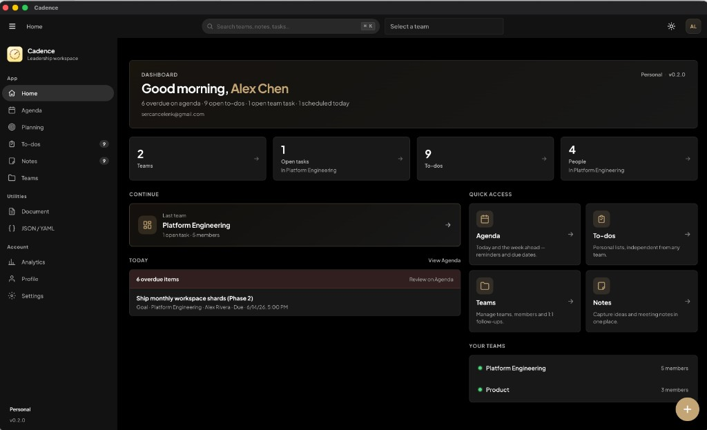
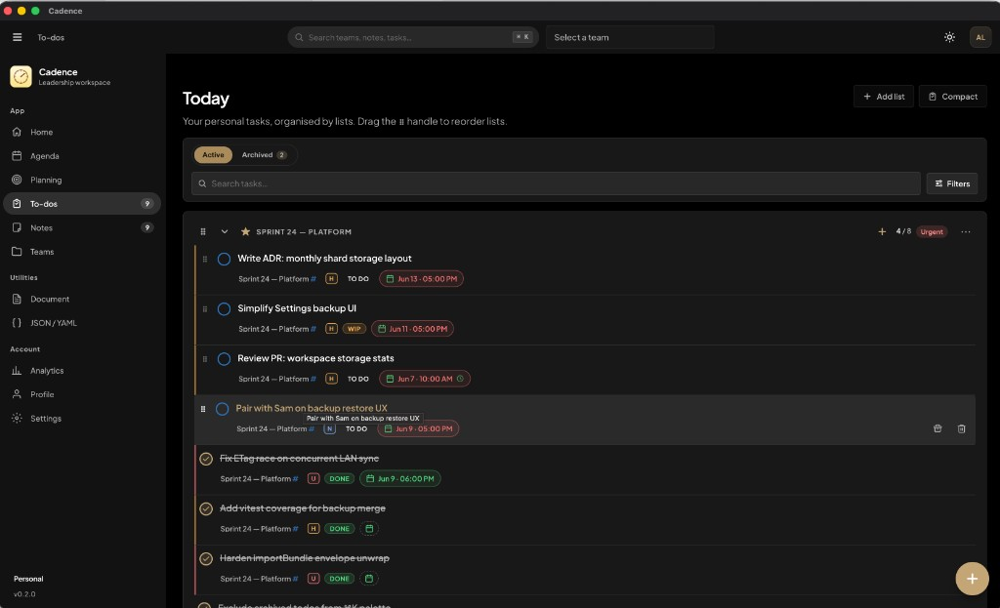
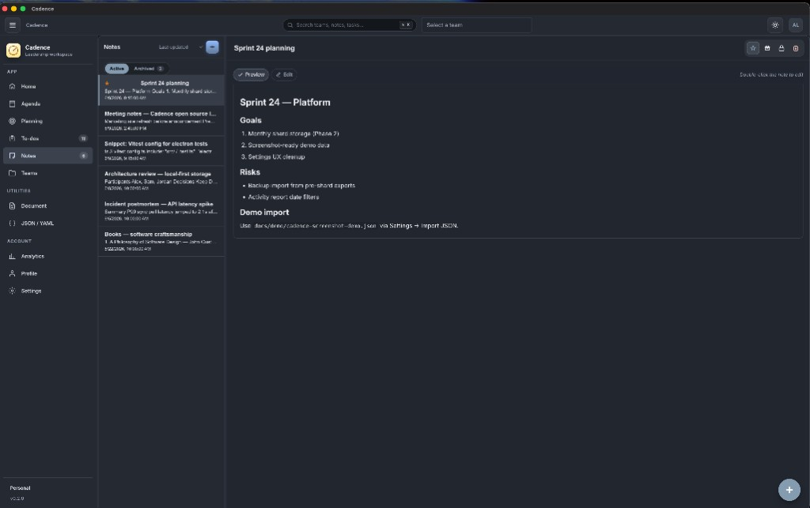
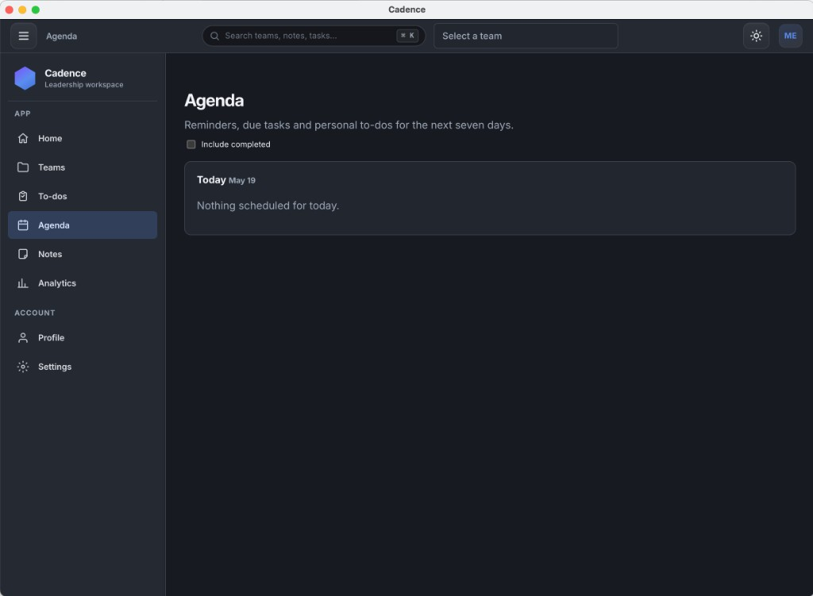
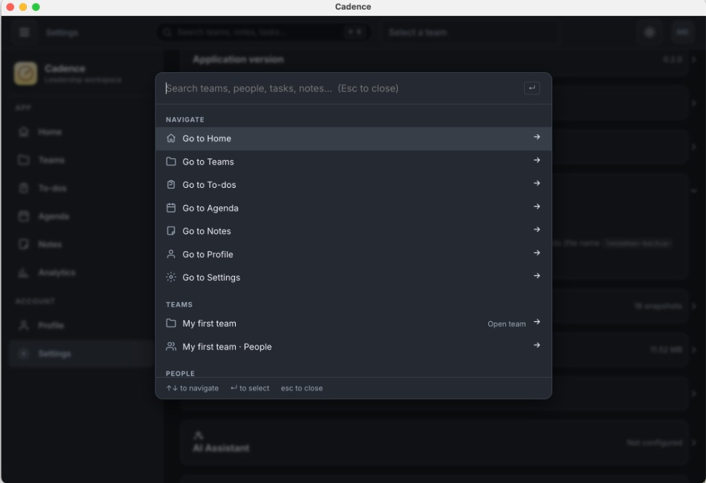
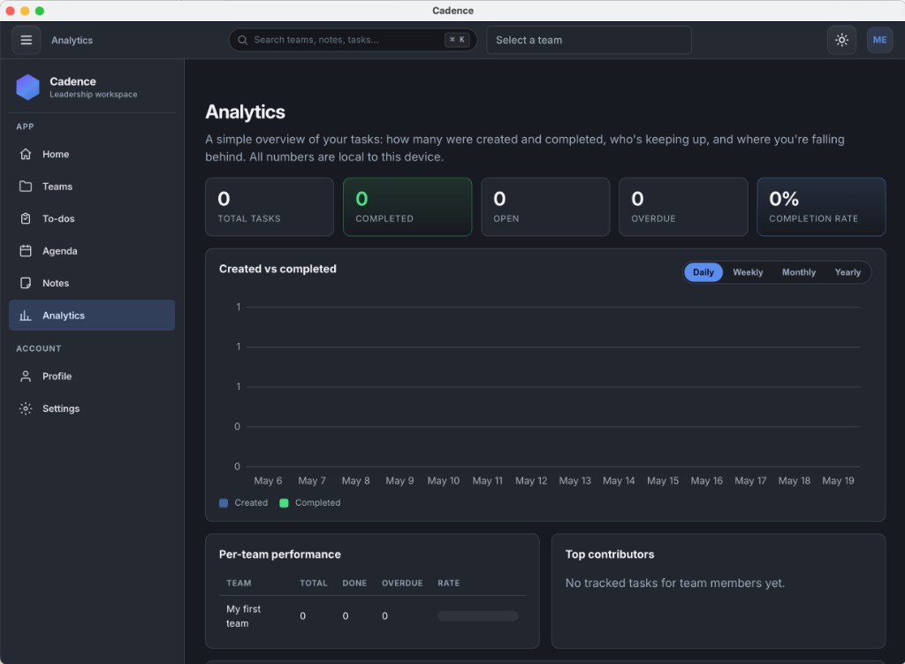
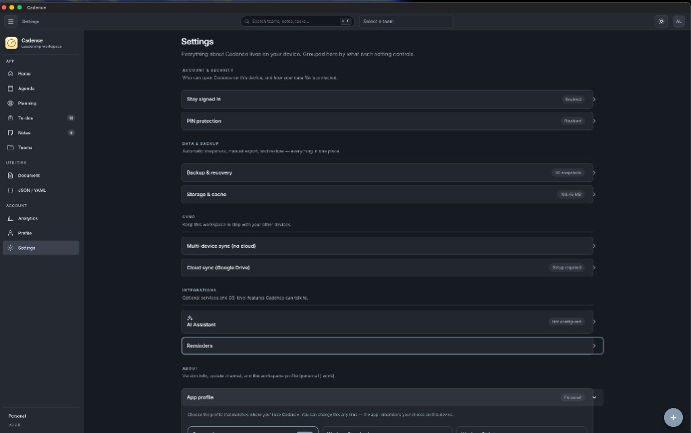

<!-- markdownlint-disable MD033 MD041 -->
<div align="center">


# Cadence

### A local-first workspace for the way you actually work.

**People, tasks, notes and agenda — encrypted on your device.<br/>AI when you want it, off when you don't.**

[](https://github.com/sercancelenk/cadence/actions/workflows/release.yml)
[](https://github.com/sercancelenk/cadence/actions/workflows/ci.yml)
[](https://github.com/sercancelenk/cadence/actions/workflows/pages.yml)
[](https://github.com/sercancelenk/cadence/releases/latest)
[](#license)

[**🌐 Marketing site**](https://sercancelenk.github.io/cadence/) ·
[**🚀 Try the web app**](https://sercancelenk.github.io/cadence/app/) ·
[**⬇️ Download for macOS**](https://github.com/sercancelenk/cadence/releases/latest)

</div>

---

## Why Cadence

A planner that doesn't ship your day to someone else's server. Four trade-offs we picked the unfashionable side on:

| | |
|---|---|
| 🔒 **100% local-first** | Every keystroke is written to your machine, not to a server. Atomic `fsync`'ed writes, 50 rolling auto-snapshots, refuse-to-overwrite guard, in-app recovery UI. A power loss or kernel panic can't lose acknowledged data. |
| 🛡️ **Encrypted at rest** | The desktop data file is wrapped in **AES-256-GCM** with a key derived from your account password via `scrypt`. Notes get an opt-in passphrase lockbox on top (PBKDF2-SHA-256, 200k iters → AES-256-GCM, non-extractable `CryptoKey`). |
| 🤖 **AI is opt-in, BYO key** | Bring your own API key for **Anthropic Claude**, **OpenAI** or **Google Gemini**. Calls go directly from your device to the provider — no Cadence proxy, no telemetry. Off completely if you leave the key blank. |
| 📖 **Open source, no upsell** | The codebase is on GitHub under MIT. No accounts in the cloud, no premium tier, no waitlist. The desktop app auto-updates straight from GitHub Releases. |

> **About the name** — Cadence is the new name for the project formerly called *Leeadman*. The desktop app auto-migrates legacy data on first launch (it copies `Leeadman/` → `Cadence/`, renaming the `leeadman-*` files to `cadence-*`; the legacy folder stays as a safety net). See [Migration notes](#migration-notes-from-leeadman) at the bottom if you're coming from a pre-rename build.

---

## Screenshots

A quick tour of the desktop app. Every page below is the **macOS Electron build** in dark mode — the light theme mirrors the same layouts.

### Home — global search and quick access



> The top bar carries a Bootstrap-style **global search pill** with a `⌘ K` / `Ctrl K` shortcut badge — clicking it (or pressing the shortcut) opens the command palette that fuzzy-searches across navigation targets, teams, people, items, to-dos **and notes (titles + content)**.

### To-dos — Kanban-shaped status, Markdown details, drag-reorder



> Each row carries a **status**: *To do · In progress · Done · Cancelled*. Filter by status (All / Open / individual states), sort by **Manual / Priority / Due date / Status (Kanban order)**, and drag rows by the grip handle to reorder manually. Completion rate excludes cancelled rows — dropping a task on purpose shouldn't drag your numbers down. The list still supports hide-closed, archive, per-list priority and cross-list search. Every task can carry optional **Markdown details** (same Write / Preview editor + formatting toolbar as Notes) — click **Add details** when creating a task, or the 📝 toggle on any row. Search matches **title and details**, not just the one-liner.

### Notes — resizable sidebar, sort modes, Markdown toolbar



> Drag the divider between the sidebar and the editor to resize the list (220–560 px). The sidebar offers five sort modes (**Last updated / Last opened / Created / Title / Manual**) — in *Manual* a grip handle appears on each row for drag-reorder. Notes open in *Preview* by default; switching to *Write* reveals a full Markdown formatting toolbar (B / I / S / H1–H3 / lists / link / inline code / code block / divider, with ⌘B / ⌘I / ⌘K shortcuts). Locked notes are AES-256-GCM-encrypted at rest and the *Remove notes passphrase* button always re-prompts for the passphrase.

### Agenda — Today / This week / Overdue



> One unified view of every reminder, due task and personal to-do for the next seven days, plus an *Overdue* bucket up top.

### ⌘K command palette — search anything, deep-link to it



> Hit `⌘K` (or `Ctrl+K`) from anywhere to open the palette. It indexes **titles and body text** across notes, tasks, items and team scratchpads, highlights matches with contextual snippets, and Enter takes you straight to the source — no scrolling required. Locked notes are searchable by title only (their bodies stay encrypted).

### Analytics — fully local dashboard



> Completion rate, a daily / weekly / monthly / yearly created-vs-completed SVG chart, per-team performance bars and a top-contributors table. The dedicated **To-do status breakdown** section adds counts for *To do / In progress / Done / Cancelled* plus a horizontal stacked bar that visualises the proportions. Completion rate excludes cancelled. Nothing leaves your device — the chart is rendered as inline SVG.

### Settings — appearance, PIN, backups, AI, LAN sync



> Theme toggle, PIN lock with rate-limited recovery, rolling backup snapshots with per-snapshot counts and one-click restore, AI assistant (BYO API key for Claude / ChatGPT / Gemini), LAN sync server, storage diagnostics and auto-update controls.

---

## What's in the box

### For your daily ritual

| | |
|---|---|
| 📝 **Notes** | macOS-Notes-style two-pane view, **resizable sidebar** (220–560 px), preview-by-default with a one-click flip into a Markdown editor + formatting toolbar (B / I / S / H1–H3 / lists / link / inline code / code block / divider, with `⌘B` / `⌘I` / `⌘K` shortcuts). Five sort modes plus drag-to-reorder inside the pinned tier. Optional per-note passphrase lockbox. |
| ✅ **To-dos** | Lists grouped by project, each with its own priority (Urgent / High / Normal / Low) and per-row **status** (To do / In progress / Done / Cancelled). Optional **Markdown details** per task (Notes-grade editor). Sort by Manual / Priority / Due date / Status (Kanban order). Filter by status. Drag items between groups and within. Recurring reminders (daily / weekly / monthly) fire as desktop notifications. Hide / show closed, archive, search (title **and** details), bulk ops. Clear warnings when every list is archived but tasks still exist on disk. |
| 📅 **Agenda** | Unified Today / This-week / Overdue view combining reminders + due tasks + personal to-dos. Lives offline; never asks for calendar permission. |
| 👥 **Teams + People** | Group people into teams, give each a private scratchpad and a running agenda. **1:1 mode** with a persistent markdown meeting agenda + archive of past meetings; unchecked items carry over. **Person Timeline** for review prep. |
| 🔎 **⌘K command palette** | Global search across notes, tasks, items, people and navigation targets. Indexes **body text** (not just titles), highlights matches with contextual snippets, deep-links straight to the result. Locked notes searchable by title only. |
| 📊 **Analytics** | Local-only dashboard: completion rate, daily / weekly / monthly / yearly created-vs-completed SVG chart, per-team performance bars, top-contributors table. |

### Powered by your device

| | |
|---|---|
| 🔒 **Encrypted at rest** | AES-256-GCM data file keyed via `scrypt(password)`. Notes get an additional PBKDF2 → AES-256-GCM lockbox with a non-extractable `CryptoKey`. |
| 🛟 **Durable saves** | Atomic `open → write → fsync → close → rename` cycle plus directory fsync. A power loss or kernel panic leaves either the old file or the new file — never a torn one. Worst case: ≤ 400 ms of unflushed typing. |
| 🗂️ **Auto-backups** | 50 rolling snapshots in `backups/<userId>/` (labelled `launch` / `post-login` / `pre-save` / `pre-pwchange` / `pre-restore`) with a one-click in-app restore. Each snapshot shows teams / lists / tasks / notes counts; **Reveal in Finder** for manual inspection. Refuse-to-overwrite guard if the live file is undecipherable. |
| 🛡️ **Data-integrity guard** | After every successful save, a per-device fingerprint records how much content you had. On the next boot, if the loaded file is meaningfully smaller, an amber banner spells out the before/after counts and links straight to *Backups & recovery* — so "my data vanished" is caught before you panic. |
| 📡 **Optional LAN sync** | Token-protected **HTTPS** server inside Electron (off by default) with self-signed TLS (RSA 2048 / SHA-256), constant-time token compare, DNS-rebinding resistance, same-LAN CORS, ETag optimistic concurrency and payload-shape validation. The host also serves the PWA itself, so an iPhone can scan the QR code and open `https://<host-ip>:9787/` directly — no cloud round-trip. |
| 🚫 **No telemetry** | Zero network calls outside of (a) the auto-updater hitting GitHub Releases, and (b) the AI assistant hitting whichever provider you configured. Nothing else dials home. |
| 🏢 **Enterprise / shared-device ready** | Three onboarding presets (Personal / Work-Standard / Work-Strict) the user picks at first launch, plus an admin-deployable `policy.json` (cross-platform, 5-layer search) that **wins over the user preset** and gates Sync / AI / Export / Updates with defence-in-depth in the Electron main process. A separate "Cadence for Work" build flavor (`npm run build:enterprise`) ships a locked binary with its own app ID and update channel. See [docs/ENTERPRISE.md](docs/ENTERPRISE.md) and [docs/DEPLOYMENT-AND-POLICY.md](docs/DEPLOYMENT-AND-POLICY.md) (updates, fresh installs, self-restriction). |

### AI when you want it

| | |
|---|---|
| 🪶 **Task extractor** | Drop a wall of meeting notes / brain dump → get a clean ordered task list back, ready to file into any project group. |
| 🧭 **Coaching on a task** | One-line reframing + three concrete next actions ordered by leverage + one risk to avoid. Always under 200 words. Tunable system prompt in Settings. |
| 🎛️ **Three providers, one switch** | Anthropic Claude, OpenAI ChatGPT, Google Gemini. One dropdown to swap. |
| 🛑 **Off completely** | No key, no AI — the rest of the app behaves identically. AI is gated behind "is the key configured?", so an offline workspace is the default, not a degraded mode. |

### Distribution

| | |
|---|---|
| 🖥️ **macOS desktop** | Universal signed + notarized DMG (Apple Silicon + Intel). Auto-updates via GitHub Releases with an in-app progress dialog. Optional PIN lock at launch with rate-limited account-password recovery. |
| 📱 **PWA** | Installable on iOS / Android / desktop browsers. Slide-in drawer sidebar, full-screen content, iOS safe-area aware. Offline-capable. Data lives in the browser's storage on that device. |
| 🐧 **Windows / Linux** | Code is fully cross-platform — encryption + backup + auto-update behave identically. No CI binaries yet; [build locally](#windows--linux-builds-experimental-not-in-ci) when you need one. |

---

## Table of contents

**For users**

- [Why Cadence](#why-cadence)
- [Screenshots](#screenshots)
- [What's in the box](#whats-in-the-box)
- [Install](#install)
- [Getting started](#getting-started)
- [Concepts](#concepts)
- [Power features](#power-features) (notes, to-dos, AI, backups, LAN sync, …)
- [Mobile / PWA](#mobile--pwa)
- [Keyboard & native menus](#keyboard--native-menus)
- [Data, privacy and backups](#data-privacy-and-backups)
- [Auto-updates](#auto-updates)

**For developers**

- [Building from source](#building-from-source)
- [Releasing](#releasing)
- [macOS code signing & notarization](#macos-code-signing--notarization)
- [Project structure](#project-structure)
- [Electron deep dive](#electron-deep-dive)
- [Troubleshooting](#troubleshooting)
- [Roadmap](#roadmap)
- [Contributing](#contributing)
- [Migration notes (from Leeadman)](#migration-notes-from-leeadman)
- [License](#license)

---

## Install

### macOS desktop (signed + notarized)

1. Go to the [latest release](https://github.com/sercancelenk/cadence/releases/latest).
2. Download `Cadence-<version>-universal.dmg`. This is a **universal binary** that runs natively on both **Apple Silicon** (M1/M2/M3/M4) and **Intel** Macs — one file for everyone.
3. Open the DMG and drag `Cadence.app` into `Applications`.
4. Launch from Launchpad or Spotlight (⌘ + Space → "Cadence").

Because the DMG is signed with a **Developer ID Application** certificate **and** notarized by Apple, you will not see any "damaged" or "unidentified developer" warning.

### Mobile (PWA on iOS / Android)

1. On your phone, open `https://sercancelenk.github.io/cadence/` in **Safari** (iOS) or **Chrome** (Android).
2. **iOS:** tap the **Share** button → **Add to Home Screen**.
   **Android:** tap **⋮** → **Install app**.
3. Launch from the home-screen icon. The app opens full-screen and jumps straight to the To-dos page.

> **Mobile data is separate by default.** The PWA stores its own data in the phone's `localStorage` (independent of the desktop's encrypted file). To move data between devices use [LAN sync](#lan-sync-multi-device-no-cloud), or *Settings → Backup → Export JSON / Import JSON* as a manual fallback.

### Unsigned local builds

If you build a DMG yourself **without** code signing, macOS quarantines it ("… is damaged"). Bypass once with:

```bash
xattr -dr com.apple.quarantine /Applications/Cadence.app
```

The official Releases DMG never needs this.

---

## Getting started

1. Launch Cadence.
2. Click **Create one** under the sign-in card. Pick an email, display name and a password (8+ chars). The account exists **only on this device**.
3. A **three-card welcome tour** appears on first launch — it explains the workspace, the two optional sync paths (LAN / Drive) and where to go for AI key + sync setup. Hit *Skip* if you already know what you're doing; *Get started* if you want the orientation. Cadence remembers you've seen it (`localStorage["cadence.tour.completed.v1"]`) and won't show it again on this device. Returning devices (anything with an existing LAN pair or Drive tokens) skip the tour automatically.
4. You land on the Home screen. From there you can:
   - Open the auto-created **My first team**.
   - Create new teams from the *Teams* page.
   - Manage personal lists in *To-dos*.
   - See everything due today/this week in *Agenda*.
5. Press <kbd>⌘ K</kbd> (or <kbd>Ctrl K</kbd>) anywhere to jump to people, items or pages instantly.

> Tip: install Cadence on a second machine and use *Settings → Backup → Export JSON / Import JSON* to move your data — or skip the manual step entirely with **Settings → Cloud sync (Google Drive)** for end-to-end-encrypted background sync between every device.

---

## Concepts

```
Account
└── App data file (JSON)
    └── Teams[]
        ├── Me              (auto-created per team)
        ├── My leader       (auto-created per team)
        └── People[]
            ├── Profile + scratchpad (markdown)
            ├── 1:1 agenda (markdown, archivable)
            └── Items[]
                ├── Task          (due date, reminders)
                ├── Goal          (status, start, deadline)
                ├── Note          (markdown body)
                ├── Feedback      (praise / coaching / concern)
                └── Document      (URL)

Personal
└── To-do lists (pin, archive, search, bulk ops)
```

- **Account** — local user; password is stored as a salted scrypt hash.
- **Team** — a workspace boundary. Mark teams as Active / Paused / Archived and pin favourites.
- **Me** — your personal space inside a team.
- **My leader** — a dedicated workspace for the relationship with your manager.
- **People** — direct reports / peers; each one has a profile, scratchpad, 1:1 agenda and items.
- **Items** — task, goal, note, **feedback**, document. All can carry markdown body and reminders.
- **To-dos** — personal lists, fully decoupled from teams.

The complete data model is in [`src/model.ts`](./src/model.ts).

---

## Power features

### ⌘K command palette

The top bar carries a **global search pill** ("Search teams, notes, tasks…") sitting next to the team-switcher — click it, focus it with `/`, or press <kbd>⌘ K</kbd> (macOS) / <kbd>Ctrl K</kbd> (Windows / Linux) and the same palette opens. The button is both an entry point and a visual reminder of the keyboard shortcut (the trailing `⌘ K` / `Ctrl K` badge auto-adapts to the platform).

The palette searches across:

- **Navigate** — Home, Teams, To-dos, Agenda, **Notes**, Profile, Settings.
- **Teams** — jump straight to any team or its People page.
- **People** — every person across every team.
- **Items** — every task / goal / note / feedback / document by title.
- **To-dos** — every personal task.
- **Notes** — every standalone note. Locked notes are searched by **title only** (we never decrypt bodies through the palette, and the title row carries a 🔒 + *Locked* hint so you know what you're clicking on).

Picking a Notes hit navigates to `/notes?id=<id>`; the page selects that note on mount and immediately strips the query string from the URL so a refresh doesn't keep fighting your manual navigation.

Arrow keys to move, <kbd>Enter</kbd> to open, <kbd>Esc</kbd> to close.

### Markdown editing

Notes, **personal to-do details**, team-item bodies, person scratchpads and 1:1 agendas all use **GitHub-flavored markdown** with a Write / Preview toggle:

- Headings, bold/italic, lists, blockquotes, code blocks.
- Checklists (`- [ ]` / `- [x]`).
- Tables, autolinks, strikethrough.
- External links open in your default browser.

In *Write* mode the editor now also shows a **formatting toolbar** that operates on the current textarea selection (and falls back to a placeholder when nothing is selected, so the user can immediately type to replace it):

| Button | What it does | Shortcut |
|---|---|---|
| **B** | Wraps selection in `**…**` (bold) | <kbd>⌘ B</kbd> / <kbd>Ctrl B</kbd> |
| **I** | Wraps selection in `*…*` (italic) | <kbd>⌘ I</kbd> / <kbd>Ctrl I</kbd> |
| **S** | Wraps in `~~…~~` (strikethrough) | — |
| **H ▾** | H1 / H2 / H3 — prepends `#`, `##`, `###` to every line in the selection | — |
| • / 1. / ☐ | Prepends `- `, `1. `, or `- [ ] ` to every line | — |
| 🔗 | Inserts `[selection](https://)` and parks the caret over the URL placeholder | <kbd>⌘ K</kbd> when the textarea is focused |
| `</>` | Wraps in single backticks (inline code) | — |
| `{ }` | Inserts a fenced \`\`\`code block\`\`\` around the selection (smart-aware of line boundaries) | — |
| — | Inserts a `---` horizontal divider | — |

The toolbar is line-aware (lists and headings always operate on whole lines, never mid-word) and focus-preserving (the caret lands inside the new markup so you can keep typing without picking up the mouse again).

### Person Timeline

Every person page has a **Timeline** tab that shows a chronological feed of *every* item attached to that person — tasks, goals, notes, feedback, documents — grouped by day (Today / Yesterday / Friday / …) and filterable by kind. Designed for review prep ("what happened with Alice in Q3?").

### 1:1 Mode

Every person also has a **1:1 Mode** tab with two halves:

1. **Current agenda** — a persistent markdown document seeded with sections (Wins / Blockers / Action items / Notes). Use `- [ ]` for action items.
2. **Past meetings** — when you click **Archive meeting**, the current agenda becomes a dated note (`1:1 · 15 May 2026`) attached to that person, and the agenda resets. Any unchecked action items are carried over into the new agenda automatically.

The archived meetings are regular notes, so they also show up in the Person Timeline.

### Agenda

The `/agenda` page is a global, **unified view** of:

- **Overdue** — anything past its due date / reminder still open.
- **Today** — always shown, even when empty.
- **The next 6 days** — only shown when they have entries.

It mixes team-item reminders + due dates with personal to-do dues, marks each entry with its origin team / person, and lets you mark-complete or jump to its workspace inline.

### Analytics dashboard

The `/analytics` page is a fully local, dependency-free dashboard that reads
straight from your workspace data:

- **Stat cards** — total / completed / open / overdue / completion rate.
- **Created vs completed** SVG bar chart with a Daily / Weekly / Monthly / Yearly toggle.
- **Per-team performance** — totals, completed, overdue and a completion-rate progress bar per team.
- **Top contributors** — top 10 people by completed-task count, with their team affiliation.
- **Personal to-dos** — a separate stat block for `/todos` items.

Nothing is sent off-device; the chart is rendered as inline SVG.

### Recurring reminders

Any item reminder can be made **daily / weekly / monthly**. When the reminder fires, the next occurrence is computed and assigned automatically — you never have to recreate weekly 1:1 reminders.

### Feedback log

Every person has a dedicated **Feedback log** alongside Tasks/Goals/Notes/Documents. Each entry is tagged with one of:

- **Praise** (green)
- **Coaching** (blue)
- **Concern** (red)

This makes performance-review prep and growth-conversation prep trivial — open the person's Timeline, filter to Feedback, and you have your talking points.

### Smart to-do lists

The `/todos` page scales as your lists grow:

- **Drag-and-drop reorder, lists and items** — grab the grip handle next to a list title and drop it anywhere; dropping a list across the pinned/unpinned line toggles its pin state automatically. Inside a list, drag individual items by their handle to reorder them.
- **Priorities** — every list and every item has an optional priority chip (Urgent / High / Normal / Low). Use the **Sort** dropdown (Manual / By priority / By due date) to reshape the list on the fly without losing your manual order.
- **Hide / show completed** — toggle at the top of the page; persists per-device so you can keep a clean active view by default.
- **Delete confirmation** — clicking the trash icon arms the row for 3 seconds and turns into a confirm button, so a finger-slip doesn't lose a task.
- **Multi-line task input** — task title is a proper auto-resizing textarea (Enter inserts a newline, ⌘ / Ctrl + Enter submits). Edit an existing task title the same way.
- **Markdown details (optional)** — every task can carry a long-form body: click **Add details** in the new-task form, or the 📝 toggle on any row. The editor is the same component as Notes (Write / Preview tabs, formatting toolbar, GFM checklists / tables / links). Existing tasks with a body open in Preview by default; closing the panel commits on blur.
- **Quick scheduling** — every task row has a `Schedule` chip that opens a popover with **Today 5pm**, **Tomorrow 9am**, **+3h**, **Next Mon 9am** presets, plus a custom datetime picker and a one-tap "Clear schedule" action.
- **Pin to top / Archive** — star a list to keep it above the rest, or archive it (toggle "Show archived" to bring them back). If **every** list in a workspace is archived, the page shows an explicit amber alert ("your data is safe — N items inside archived lists") instead of looking empty; the sidebar badge turns amber too.
- **Compact / Comfortable toggle** — clearly labelled in the top-right.
- **Mark all complete** / **Clear completed** — bulk operations with confirmations.
- **Search** — filter tasks across all lists in real time; matches **title and Markdown details**, not just the one-liner.
- **Inline rename** — click the list title to edit.
- **Counts** — every list shows `<open> / <total>` at a glance.

### AI Assistant (BYO API key)

Every task row has an **Ask AI** button as soon as you connect a provider in *Settings → AI Assistant*. The assistant takes the task title + optional Markdown details + your custom system prompt and returns a structured next-action plan, rendered as Markdown in a side dialog.

- **Bring your own key** — pick a provider, paste your API key, optionally override the model name. There is **no proxy**; calls go from this device straight to the provider you chose. The provider sees your task title/body but not your other data.
- **Providers supported**
  - **Anthropic Claude** — default `claude-3-5-sonnet-latest`. Suggested: `claude-3-5-sonnet-latest`, `claude-3-5-haiku-latest`, `claude-3-opus-latest`.
  - **OpenAI ChatGPT** — default `gpt-4o-mini`. Suggested: `gpt-4o-mini`, `gpt-4o`, `gpt-4.1-mini`.
  - **Google Gemini** — default `gemini-2.0-flash`. Suggested: `gemini-2.0-flash`, `gemini-2.0-flash-lite`, `gemini-2.5-flash`, `gemini-2.5-pro`. *(Gemini 1.x was retired from `v1beta` in late 2025 and returns HTTP 404; the Settings UI surfaces a one-click fix.)*
- **Test connection** button — sends a one-token round-trip so you can verify the key + model before relying on it during a real task.
- **Follow-up turns** — keep chatting in the dialog (Enter sends, Shift+Enter for newlines). Markdown answers render with headings, lists, code blocks and tables.
- **Append to task** — copy the assistant's answer straight into the task's Markdown details so it sticks around.
- **Extract tasks from notes** — open *To-dos → Extract from notes* and paste a brain dump (meeting transcript, voice-memo, Slack thread, weekend wishlist). The assistant returns a structured list with one imperative task per line and a suggested priority. You edit titles inline, pick which list each task goes into, and click **Add** (per row) or **Add all** to drop them into your workspace. Nothing is added automatically — the user is always the final filter. The prompt is constrained to return strict JSON so the picker stays predictable across providers.
- **Where the key is stored**
  - **Desktop**: inside your encrypted data file (`cadence-data-<userId>.json`, AES-256-GCM, keyed by your account password).
  - **PWA**: in this browser's `localStorage` only (not encrypted) — use a low-budget key with usage limits.

The provider-agnostic transport layer lives in [`src/lib/ai.ts`](./src/lib/ai.ts).

### Backups & recovery

`Settings → Backups & recovery` is your safety net when something goes sideways — for example after a major version upgrade, a password rotation hiccup, or registering a fresh account by mistake.

- **Auto-snapshots** — every save, every successful sign-in and every app launch copies the current `cadence-data-<userId>.json` into `backups/<userId>/data-<label>-<timestamp>.json`. A rolling window of 50 snapshots is kept; oldest are pruned automatically (~115 KB for a typical workspace — disk use stays bounded).
- **Refuse-to-overwrite guard** — the data writer refuses to overwrite an existing file when it can't decrypt it with the current session key (instead of silently destroying it). The renderer surfaces this as a red banner pointing at this page.
- **Boot-time integrity check** — after every successful save, Cadence remembers a coarse fingerprint (teams / tasks / notes counts) in `localStorage`. On the next launch, if the loaded file is meaningfully smaller than that marker, an amber **Looks like data may be missing** banner appears app-wide with exact before/after numbers and a one-click jump here. Dismissing rebases the marker to the current state.
- **Recovery list** — the page enumerates every candidate source on this machine:
  - **Current data file** (live)
  - **Legacy single-user file** (`leeadman-data.json`, from the pre-accounts era — also picked up by the one-shot rename migration)
  - **Automatic snapshots** (with human-readable "5m ago / 2d ago" times)
  - **Other accounts on this machine** — orphaned `cadence-data-<otherId>.json` files (or pre-rename `leeadman-data-<otherId>.json` files left behind), useful when you registered twice
- Each row shows the file size, modified time, encryption status, and what's inside: teams, lists (**with archived count**), tasks, notes (**with locked count**). Rows flag common "looks empty but isn't" cases — e.g. **all todo lists archived** or an orphan notes-lock with no locked notes — so you can pick a healthier snapshot before restoring.
- **Reveal** opens the snapshot in Finder / Explorer for manual diffing (`jq`, a text editor, etc.).
- **Restore** is one click and reports what you got back (e.g. `Loaded: 1 team, 5 tasks, 2 notes`). The current state is itself snapshotted as `pre-restore` first, so the operation is reversible.
- **Auto-migrate on login** — if you log in and your per-user data file doesn't exist yet, but the legacy single-user file (`leeadman-data.json` from pre-accounts builds) does, Cadence imports it into your account automatically. No more "I updated and my old data is gone" surprise.
- **Open data folder** — jumps Finder straight to `~/Library/Application Support/Cadence/` if you want to copy a backup to iCloud / a USB stick.

### Storage & cache

`Settings → Storage & cache` is the honest, read-only picture of what Cadence occupies on this device — plus a safe way to reclaim disk when the browser engine has cached a lot of HTTP responses, V8 code or GPU shaders over months of use.

- **Per-bucket sizes**: encrypted data file, legacy file, your backups, backups belonging to other accounts on the same machine, Chromium-managed caches (HTTP / code / GPU / shader, with a per-folder breakdown), total `userData` size.
- **Clear browser caches** (Electron) — wipes only Chromium-managed caches via the documented `session.clearCache()` / `clearCodeCaches()` / `clearStorageData({ storages: ['cachestorage', 'shadercache'] })` APIs. **Tasks, notes, AI keys, backups and account list are never touched.** Caches repopulate naturally; you may see a one-time slower first request or a shader recompile on next launch.
- **Reload web assets** (PWA) — unregisters the service worker and clears the `caches` API entries on this origin, then hard-reloads. Use this if the PWA feels stuck on an older version; your localStorage (AI key, UI prefs, hashed account credentials) is preserved.

This panel is purely diagnostic — you can ignore it forever and nothing degrades. The auto-prune logic already keeps backups at 50 slots and Chromium self-manages its caches; the buttons exist so you have the option, not as a maintenance chore.

### Notes (encrypted at rest)

`/notes` is a macOS-Notes-style two-pane view for free-form personal notes that don't belong to a team or a person:

- **Resizable sidebar.** Drag the thin vertical divider between the sidebar and the editor pane to size it to taste (Pointer Events under the hood, so it works with mouse, touch and pen). Bounded to 220–560 px so it never collapses to a useless slit or swallows the editor.
- **Sortable list.** A compact dropdown at the top of the sidebar offers five modes — **Last updated** (default), **Last opened**, **Created**, **Title (A→Z)** and **Manual**. Pinned notes always float to the top regardless of mode; the active mode controls the order within each pinned tier.
- **Manual drag-to-reorder.** Switch to *Manual* sort and each row grows a grip handle on the left — drag any row up or down to drop it into its new slot (a blue indicator paints the drop position). The reorder rewrites `sortOrder` only within the pinned tier the row belongs to, so you can never accidentally cross the pin boundary.
- **Editor.** A Markdown editor with edit/preview tabs (same renderer as person scratchpads and 1:1 agendas), now opening in **Preview** mode by default — reading is the common case, click *Write* to flip into the textarea + formatting toolbar (see [Markdown editing](#markdown-editing)). Title is a plain inline input; the body autosaves on every keystroke through the same debounced writer your tasks use.
- **Last-opened tracking.** Selecting a note stamps an internal `lastOpenedAt` timestamp that powers the "Last opened" sort mode. The stamp explicitly does **not** bump `updatedAt`, so opening a note never bubbles it up in the "Last updated" view.
- **Pin / Delete** — pin keeps a note at the top of the list; delete asks for explicit confirmation (locked notes get a louder warning because losing ciphertext is unrecoverable).

**Per-note lock with workspace master key.** Click the lock button on any note and you'll be prompted, once, to set a **Notes passphrase** (≥ 6 chars). From then on:

1. **One-time key derivation.** When you enter the passphrase, Cadence runs **PBKDF2-SHA-256 (200,000 iterations)** against a workspace salt (stored in `AppData.notesLock`) to derive a **256-bit master AES-GCM key**. The key is created with `extractable: false`, so its raw bytes can't be retrieved even from JavaScript — only `encrypt` and `decrypt` calls work.
2. **The passphrase string is discarded.** Only the `CryptoKey` lives in renderer memory for the rest of the session. A memory dump won't yield the passphrase. The pending-input fields in the dialog are cleared as soon as derivation succeeds.
3. **Locking a note** encrypts its body with the cached master key and a **fresh random 12-byte IV per save**. Re-encryption is a single AES-GCM block (sub-millisecond) so we can safely re-encrypt **on every keystroke** while you're editing a locked note — the cipher blob on disk is always current.
4. **Unlocking a note** decrypts the same way. The unlock dialog checks the **verifier blob** first (it tries to decrypt a known constant `"leeadman-notes-v2"`) — so a wrong passphrase is rejected *before* we touch a real note.
5. **Out-of-order encrypt protection.** A monotonic generation counter discards any encrypt result whose keystroke has already been superseded, so two near-simultaneous typings can't cause the older text to overwrite the newer ciphertext.
6. **Session lifetime.** The master key is wiped automatically by logging out, locking the app with PIN, or restarting — the `NotesUnlockProvider` lives below `AuthGate` and unmounts in any of those cases.

**Remove the passphrase.** A dedicated *Remove notes passphrase* button (padlock-with-slash icon) in the Notes sidebar header **always** prompts you to re-enter the Notes passphrase before showing the destructive confirm dialog — even if the session master key is still cached in memory from an earlier unlock this session. Once you've re-authenticated and confirmed, Cadence decrypts every locked note up-front with the current master key; if any note fails (master key mismatch) it aborts the whole operation and leaves your data untouched. On success it converts every locked note back to plaintext and clears `AppData.notesLock` in one atomic save.

**Strict per-view unlocking.** Clicking *Unlock to view* on a locked note **always** opens the passphrase prompt, even if you unlocked the same note (or another locked note) a minute ago in the same session. Navigating away from a viewed locked note clears its in-memory plaintext, and the next view request drops the cached session key and re-prompts — so locking a note actually keeps it hidden every time you come back to it, not just until you next clicked the unlock button. Editing a note that's currently visible still uses the in-memory key (so each keystroke isn't gated on a prompt), but the moment you leave the note the strict-prompt rule re-engages.

**What's stored where:**

| Thing | Plain on disk? |
|---|---|
| Locked note's body | No — only `{ ivB64, cipherB64 }` |
| Locked note's title, pin, timestamps | Yes (intentional — you can still find notes without unlocking) |
| Workspace verifier | Yes (`{ saltB64, verifierIvB64, verifierCipherB64 }`, no key material) |
| Notes passphrase | **Never** |
| Workspace master key | Renderer memory only, non-extractable, dropped on logout/lock/restart |

> **No reset path on purpose.** Because the passphrase is never written down, anyone who steals your data file (including future-you with backups) cannot derive it. If you forget the passphrase your locked notes are unreadable forever. That's the trade we make for honest at-rest encryption; if you want recoverability instead, just don't lock the note.

### Profile & change password

`/profile` is a card-first, view-by-default page:

- **Avatar** — upload any image; it's downscaled to 384 px and stored as a JPEG `data:` URL on your profile, so it shows up in the top-bar avatar everywhere.
- **View mode** — name, role, department, phone, email and bio rendered as a read-only grid; an **Edit** button (top-right) flips the same card into form mode with a Save / Cancel pair.
- **Change password** — a secondary tab that asks for **Current password**, **New password** and **Confirm**. On Electron the new password is also used to **re-encrypt your data file** in a single atomic swap; the old key is wiped from memory immediately.

### LAN sync (multi-device, no cloud)

`Settings → Multi-device sync` lets two devices on the same Wi-Fi share a workspace without any cloud service:

- The Electron app runs an optional, opt-in **HTTPS** server (default port `9787`) protected by a **bearer token** stored in `sync.json`. The TLS certificate is **generated on this device** (self-signed, never leaves the machine) and persisted in `cadence-sync-tls.json` next to the workspace data.
- Endpoints:
  - `GET  /v1/ping` — **unauthenticated** reachability probe; clients hit this to distinguish "host unreachable" from "host reachable but wrong token".
  - `GET  /v1/snapshot` — returns the active user's data, with an `ETag` header. Clients sending `If-None-Match` get a zero-body **304 Not Modified** when nothing has changed since their last pull.
  - `POST /v1/snapshot` — replaces the active user's data (Bearer token required). Clients sending `If-Match` get a **412 Precondition Failed** if the host has moved on since their last pull — Cadence then prompts to pull the newer version instead of silently overwriting it.
  - `GET  /*` — serves the **bundled PWA assets** (index.html, JS, CSS, icons) from the host's own `dist/` folder. This is what defeats the "https://github.io → http://lan" mixed-content block and powers QR pairing, see below.
- Settings shows the host's reachable LAN URLs, the pairing token (with a Rotate button), a **scannable QR code** for one-tap mobile pairing and a **Pair with another device** form for the *client* side.
- The server auto-resumes on next launch if you previously enabled it.

**QR-code pairing.** The host card renders a QR encoding `https://<lan-ip>:9787/?pair=<base64url(token)>`. Open the iPhone/Android camera, point it at the code, tap the URL banner — the phone opens the PWA bundled on the desktop. On the *first* pairing the browser shows a **"Your connection is not private"** warning because the cert is self-signed and the phone doesn't know about it yet; tap **Advanced → Visit Website / Proceed Anyway** once and your phone will remember this device permanently. The PWA then loads from the host (same-origin, no mixed-content) and the **`?pair=` handler** stores the URL + token in the phone's `localStorage` automatically. No typing the IP, no typing the 192-bit token, no further warnings.

**Bidirectional auto-sync.** Once a client is paired, the app keeps both sides in sync in the background — **push first, pull after**:

- ~500 ms after launch (opening the PWA on your phone shows the latest data straight away and ships any unpushed edits up).
- On window focus and `visibilitychange` to visible (you tabbed away → came back, or unlocked the phone).
- On `online` events (the OS just told us Wi-Fi came back).

Each cycle computes the local snapshot's ETag (same SHA-256 prefix formula the host uses, so the bytes line up) and compares with `pair.etag` (the host's last-confirmed ETag):

- **First pair** (no prior etag) → pull only, adopt the host's state and ETag.
- **Local matches host** → conditional pull with `If-None-Match`. The host returns **304 Not Modified** with zero body when nothing has changed since.
- **Local differs from host** → push with `If-Match: pair.etag`. On 200 OK we adopt the new ETag and skip the pull (the host now has our snapshot, there's nothing to download). On **412 Precondition Failed** we *silently bail* — the desktop edited too, and overwriting either side would lose data. The next manual Push from Settings surfaces an explicit "Pull host's version first?" dialog so the user resolves the conflict deliberately.

All cycles share the same throttle (minimum 30 s between attempts, no calls when `navigator.onLine` is false, in-flight lock to prevent concurrent runs). Errors are silent in the background path — the badge going stale is the signal — while Settings shows targeted messages for explicit Pull/Push actions.

**Optimistic concurrency.** Manual **Push to host** sends `If-Match: <pair.etag>` too — if the host's snapshot has moved on, the request is rejected with **412** and the UI offers a "Pull host's version first?" dialog. Last-write-wins becomes a deliberate choice, never an accident.

**Connection badge.** When this device is paired, the *Pair with another device* card flips to **Paired with host** — green dot, the canonical host URL, "synced 3 min ago" relative timestamp (auto-refreshes every minute) and a **Disconnect** button that clears the saved pair.

**Mobile / PWA pairing — why HTTPS:** modern browsers' "HTTPS-Only Mode" (Firefox), "Always use secure connections" (Chrome) and Safari Private Relay refuse to navigate to `http://` URLs in many configurations. They also block `fetch()` from HTTPS pages to HTTP hosts entirely (active mixed-content rule). Self-signed HTTPS on the desktop sidesteps both: the URL is `https://`, so browsers navigate to it; and a github.io-hosted PWA can `fetch` it without mixed-content blocking. The trade-off is the one-time **"Your connection is not private"** warning on first pairing per device — the certificate is generated by the host with a 800-day validity (within Apple's hard cap), persists on disk, and is reissued only when the LAN IP changes or expiry nears.

**Cert fingerprint display.** The host card shows the first 8 bytes of the SHA-256 cert fingerprint so a security-conscious user can verify out-of-band that the warning on their phone matches the certificate the host actually issued.

**Client UX**: the pair form normalises whatever you type (adds `https://`, defaults port `9787`), has a **Test reachability** button that pings `/v1/ping` with an 8-second timeout, and gives targeted error messages — `401` ("token rotated/wrong"), `503` ("no user signed in on the host"), `412` ("host has newer changes"), timeout ("check Wi-Fi and that the host server is running") instead of a generic "Pull failed".

#### Sync security — what we did and didn't do

The threat model is "untrusted devices on the same Wi-Fi" and "a malicious public website trying to reach into the user's LAN through their browser". Defenses, in code:

- **TLS encryption on the wire.** Sync runs over HTTPS with a self-signed cert (RSA 2048, SHA-256), TLS 1.2+. Even an attacker who's joined your Wi-Fi sees only encrypted bytes — not the workspace, not the bearer token.
- **Random 192-bit token.** `crypto.randomBytes(24)` per workspace, base64-encoded. Brute-force is not on the table.
- **Constant-time token compare.** `crypto.timingSafeEqual` instead of `===`, plus a small artificial delay on failure paths so 401 vs 200 cannot be cleanly differentiated by latency measurement.
- **DNS-rebinding defense.** Every request's `Host:` header is checked against a private-IP / localhost / `.local` allow-list. A browser that's been tricked into thinking `attacker.com` resolves to your LAN IP still sends `Host: attacker.com` — we send back 403 before any route runs.
- **CORS without wildcards.** `Access-Control-Allow-Origin: *` is never returned. We echo the request `Origin` only when it parses to a private-IP / localhost / `.local` hostname, otherwise no CORS header is set — so a malicious public web origin can't pivot through the user's browser even if it had the token.
- **Payload shape validation.** `POST /v1/snapshot` rejects bodies that don't have the required `AppData` discriminators (`version`, `teams`, `people`, `items`, `todoGroups`, `todoItems`) with a 422 before writing.
- **Minimal `/v1/ping`.** Returns `{ ok: true, name: 'leeadman-sync' }` only — no version, no session indicator, no fingerprintable metadata.
- **Body size cap.** `POST` bodies over 25 MB get an explicit `413 Payload Too Large` response (with a JSON error body) before we keep buffering, instead of a bare socket reset that the client would render as a useless "Pull failed".
- **Refuse-to-overwrite + auto-backup.** Even if a properly-authenticated client pushes a corrupt-but-shape-valid payload, the writer takes a snapshot before saving and refuses to save an undecipherable file. Worst case: one round-trip to the **Backups & recovery** tab.

#### Why self-signed HTTPS (not plain HTTP, not a real CA cert)

We tried plain HTTP first. It didn't survive contact with modern browsers:

- Firefox's *HTTPS-Only Mode* (default in some installs) refuses to navigate to `http://` URLs — the QR-scan flow dies before it begins.
- Chrome's *Always use secure connections* does the same. Safari Private Relay forwards LAN IPs in opaque ways that broke pairing on some networks.
- The active mixed-content rule prevents `https://*.github.io` from `fetch`-ing `http://192.168.x.x`, so a PWA installed from GitHub Pages couldn't talk to the host at all.

A *real* CA-signed certificate is also off the table: it requires a public DNS name resolvable from the internet and ports 80/443 reachable for ACME challenge — which is exactly what a LAN-only tool is trying to avoid.

That leaves self-signed HTTPS, which we do. The cost is a **one-time** "Your connection is not private" warning on each device — the phone caches the cert exception after the user taps "Proceed Anyway" once. Every subsequent visit is silent. To keep the prompt rare we:

- Generate the cert with all detected LAN IPs in the **Subject Alternative Names** (Wi-Fi + Ethernet + VPN at once), so changing networks usually doesn't re-trigger the warning.
- Set validity to **800 days** — under Apple's 825-day hard limit for self-signed server certs, so iOS Safari accepts it.
- Re-issue automatically only when (a) the cert is within 30 days of expiry, or (b) a current interface IP isn't covered by the existing SAN list (you joined a new network).

On a trusted home network, self-signed HTTPS + the bearer token + the hardening below is honest and works with modern browsers' defaults. If your threat model includes an untrusted Wi-Fi network (a coffee shop, a hotel) — don't run the sync server there at all; the toggle is off by default for a reason.

---

### Cloud sync (Google Drive, end-to-end encrypted)

LAN sync is great when both devices share a network, but the moment you walk out the door your phone is on its own. **Cloud sync** plugs Cadence into your own Google Drive so the same encrypted snapshot is reachable from anywhere — without giving Google the ability to read your notes.

#### What you get

- **End-to-end encryption.** Snapshots are wrapped with AES-256-GCM (PBKDF2-SHA-256 KDF, 200 000 iterations, fresh salt + IV per upload) **on your device** before they leave it. Google sees an opaque ~1 MB blob and nothing else. The decryption passphrase never touches Google's servers.
- **Drive `appData` scope.** Cadence stores its snapshot in the hidden per-app data folder that Drive provides specifically for this purpose. The file is invisible in your Drive UI, isolated from every other app you connect, and counts against your normal Drive quota.
- **Optimistic concurrency.** Every push compares the file's `version` against what you last saw — a conflict triggers a clear prompt with explicit "Pull first" / "Override remote" buttons instead of clobbering remote edits silently.
- **Resilient HTTP.** Transient Drive errors (5xx, 429 rate-limit, network blips) are retried automatically — three attempts with full-jitter exponential backoff before the UI sees a failure. Persistent errors surface as a clear banner in Settings rather than dying silently.
- **OAuth PKCE.** No client secret ships in the bundle. The browser proves possession of a random code verifier at token-exchange time, so an intercepted auth code is useless to an attacker.
- **Self-defending pulls.** The remote snapshot is validated by `parseRemoteSnapshot` before it can replace local data — a malformed or empty blob is rejected and the user keeps editing locally instead of waking up to an empty workspace.
- **Workspace shared drives** (advanced). Power users can carry the same model into Google Workspace shared drives by extending the backend in `src/lib/syncBackends/gdrive.ts` — the appData design already isolates per-user data, and shared drives just slot in as scoped parents.

#### Setup (~5 minutes, free)

You only need to do this if you forked Cadence or are running a build that did not ship with an OAuth client ID embedded. The official build ships with a working client ID baked in; on that build, **Settings → Cloud sync** opens straight to a "Sign in with Google" button and you can skip this section entirely.

There are two ways to wire in your own client ID:

##### A. In-app (recommended — DMG / portable / non-rebuilt installs)

Cadence supports user-supplied client IDs at runtime, so you do **not** have to fork the repo or set environment variables. Just open the app:

1. **Settings → Cloud sync (Google Drive)** — the card shows the "Setup required" banner.
2. Walk through the 5 numbered steps shown in the card (or follow the same steps below — they're identical) to create a Google Cloud project and an OAuth Web client ID.
3. Tap **"I have my client ID — paste it here"**, paste the value, **Save client ID**.
4. The card flips into the connected-state UI. Click **Sign in with Google**.

The client ID is stored in `localStorage` under `cadence.sync.gdrive.clientId.v1`. To clear it later, expand the same card and use **Clear saved ID**.

##### B. Build-time env (fork maintainers)

If you're publishing your own build of Cadence and want every install to come pre-configured, embed the client ID at compile time:

1. Open the [Google Cloud Console](https://console.cloud.google.com/) and create a new project (any name works — "cadence-sync" is fine).
2. In the new project: **APIs & Services → Library → Google Drive API → Enable**.
3. **APIs & Services → OAuth consent screen**. Choose "External" (for personal use) or "Internal" (only your Google Workspace organisation will sign in). Fill in:
   - App name: anything you'll recognise
   - User support email: your email
   - Developer contact: your email
   - Scopes: add `…/auth/drive.appdata` (no other scopes — keeps the consent screen lean)
   - Test users (External only): add the Google accounts you want to sign in with, until you publish
4. **APIs & Services → Credentials → Create Credentials → OAuth client ID**.
   - Application type: **Web application**
   - Authorized JavaScript origins: every PWA host you'll use, for example:
     - `https://<your-github-user>.github.io`
     - `http://localhost:5173` (dev)
   - Authorized redirect URIs (same origins with the PWA path):
     - `https://<your-github-user>.github.io/cadence/app/?oauth=google`
     - `http://localhost:5173/?oauth=google`
   - Copy the resulting **Client ID** (looks like `1234567890-abcdef.apps.googleusercontent.com`).
5. Drop it into your `.env`:
   ```bash
   # .env (or .env.local — both are git-ignored)
   VITE_GOOGLE_OAUTH_CLIENT_ID=1234567890-abcdef.apps.googleusercontent.com
   ```
6. Rebuild (`npm run build:pwa`) and deploy. The new build picks up the client ID at import time.

> The client ID is **public information**, not a secret. The PKCE flow is what proves it's your app each time — see [RFC 7636](https://datatracker.ietf.org/doc/html/rfc7636) if you're curious. Don't commit a service-account JSON file or an OAuth client *secret* — Cadence doesn't need either.

#### Using it

1. Open the PWA, **Settings → Cloud sync (Google Drive)**.
2. Tap **Sign in with Google**. The OAuth popup opens; consent on the screen Google shows.
3. Set a **sync passphrase** the first time. 8+ characters. Cadence uses it to derive the encryption key — write it down, because losing it makes the Drive snapshot unrecoverable. (There is no recovery — that's the whole point of E2E encryption.)
4. Use **Auto-sync provider** to pick LAN, Drive, or Off. The provider you pick drives the background sync loop; the other one stays available for manual push/pull.

On a new device (same Google account, same passphrase): sign in to Drive, enter the passphrase, hit **Pull now**. Cadence reads the encrypted blob, decrypts it locally, and seeds the workspace.

#### Limitations (today)

- **Desktop Electron build**: Drive sync is browser-only for now. The desktop card shows a placeholder. The LAN card keeps doing its job and a future release will add Drive sign-in via a custom protocol callback so the Electron app gets the same flow.
- **One snapshot per Drive**: Versioned restore points are on the roadmap (Drive keeps history on its side, but we don't surface it in the UI yet). For belt-and-braces redundancy, use **Settings → Export backup** alongside cloud sync — that's a fully decrypted JSON, on your own disk.
- **Conflict resolution is manual**: if two devices push at the same time, one wins on the server, the other sees a conflict banner and chooses whether to pull-first or override. Future work will offer field-level merge for the obvious cases (different teams edited on different devices).

---

## Mobile / PWA

Cadence ships as a **Progressive Web App** in addition to the desktop Electron build. The same React bundle is deployed to GitHub Pages and installable on iOS/Android.

### Setup (repository owner — one-time)

1. **Settings → Pages → Source: GitHub Actions**.
2. Push to `main`. The [`pages.yml`](.github/workflows/pages.yml) workflow runs, builds with `CADENCE_PWA=1`, and publishes to `https://<user>.github.io/cadence/`.

### Install on your phone

1. Open the URL above in Safari (iOS) or Chrome (Android).
2. **Share → Add to Home Screen** / **⋮ → Install app**.
3. The app installs with its own icon and launches full-screen, going straight to the To-dos page.

### What works offline

- The app shell (HTML / CSS / JS / icons) is cached on first visit.
- All your data lives in the phone's `localStorage`, so reads and edits work fully offline.
- New deploys are picked up silently the next time the device is online (service worker uses *network-first* for navigation, *stale-while-revalidate* for hashed assets).

### Building the PWA locally

```bash
# Regenerate icons after editing public/icon.svg
npm run icons

# Build for GitHub Pages (sets base path to /cadence/)
npm run build:pwa
```

### Mobile-specific UX

- **Slide-in drawer sidebar** — on screens ≤700 px the sidebar starts hidden so the content gets the full viewport. Tap the hamburger to slide it in over a backdrop; tap any link or the backdrop to dismiss. Body scroll is locked while the drawer is open.
- **No iOS auto-zoom** — every input/select/textarea renders at ≥16 px on phones, so Safari doesn't zoom in on focus.
- **Full-screen command palette** on mobile.
- **Single-column to-do row layout** with 40 px touch targets and a wrapped section header.
- **Launching from the home-screen shortcut** auto-redirects `/` → `/todos`.
- **iOS safe-area** padding is honoured (status bar / home indicator).

### Files added for PWA support

```
public/
  manifest.webmanifest      # PWA metadata
  sw.js                     # Service worker (offline cache, auto-update)
  icon.svg                  # Source vector logo
  icon-192.png              # Manifest icon (any)
  icon-512.png              # Manifest icon (any) + splash
  icon-maskable-512.png     # Adaptive icon for Android (safe-zone padded)
  apple-touch-icon.png      # 180×180 iOS home-screen icon
  favicon-32.png            # Browser tab icon
scripts/
  generate-pwa-icons.mjs    # sharp-powered icon rasteriser
src/pwa.ts                  # SW registration (skipped under Electron/file://)
.github/workflows/pages.yml # Automated Pages deploy
```

---

## Keyboard & native menus

Cadence ships with a native menu bar (English):

- **Cadence** — About, Check for Updates…, Quit
- **File** — Close window / Quit
- **Edit** — Undo / Redo / Cut / Copy / Paste / Select All
- **View** — Reload, Zoom, Toggle Full Screen
- **Window** — Minimize, Zoom
- **Help** — Project on GitHub, Report an Issue

Standard shortcuts apply (⌘ Q, ⌘ W, ⌘ R, ⌘ F, ⌘ , …). The global **⌘ K** opens the command palette from anywhere.

---

## Data, privacy and backups

- **Where data lives** (macOS): `~/Library/Application Support/Cadence/`. (Pre-rename installs originally wrote to `~/Library/Application Support/Leeadman/`; that folder is consumed and converted on first launch — see [Dev vs installed app data isolation](#dev-vs-installed-app-data-isolation).)
  - `cadence-accounts.json` — user list (email, salted **scrypt** password hash, per-user `encSalt`).
  - `cadence-session.json` — id of the signed-in user.
  - `cadence-data-<userId>.json` — your workspace data, per account, **encrypted at rest** (AI key, tasks + optional Markdown details per task, lists, people, notes, preferences — everything).
  - `leeadman-data.json` — legacy single-user file from pre-accounts versions (only present if you upgraded from an old install). Auto-imported on first login.
  - `backups/<userId>/data-<label>-<timestamp>.json` — rolling auto-snapshots (50 slots; labels include `launch`, `post-login`, `pre-save`, `pre-pwchange`, `pre-restore`).
  - `auth-lock.json` — optional PIN hash.
  - `sync.json` — LAN sync server config (token + enabled flag) when sync is on.
  - `cadence-sync-tls.json` — self-signed TLS key/cert/SAN-list for the HTTPS sync server. Regenerated when expired (800-day life) or when the LAN IP list changes.
- **Encryption-at-rest** (Electron): your data file is wrapped in **AES-256-GCM**. The 256-bit key is derived from your password with `scrypt(password, encSalt)` at login and lives only in main-process memory until logout. Changing your password atomically decrypts with the old key, derives a fresh `encSalt`, and re-encrypts under the new key. Legacy plaintext files from older versions are upgraded silently on the first save after login.
- **Refuse-to-overwrite guard**: when the data writer finds an existing file it can't decrypt with the in-memory key, it refuses to write — your data stays safe and the UI surfaces a banner pointing at *Settings → Backups & recovery*.
- **PIN protection** is an additional launch-time UI barrier (not the encryption key). It can be enabled/disabled independently in Settings. If you forget it, the lock screen has a "Forgot PIN? Reset with account password" flow (rate-limited).
- **Mobile PWA**: data lives in the browser's `localStorage` for the Pages origin and is **not** encrypted by the app — rely on the device's keychain / disk encryption.
- **No telemetry, no analytics.** Sync only happens when you explicitly use the LAN server (or Export/Import).
- **Backups**: see [**Backups & recovery**](#backups--recovery). For manual portable backups use *Settings → Backup → Export JSON*; the export is the **decrypted** data so you can diff / migrate it. Treat it like a sensitive file. Use *Import JSON* to restore — it replaces your current data (and snapshots the old state first).

### Durability guarantees (won't I lose data on a crash?)

The desktop build is engineered so a kernel panic, power loss or kill-9 cannot silently lose acknowledged writes:

- **Atomic, fsync'ed writes.** Every save opens a sibling `.tmp` file with an explicit `open → write → fsync → close` cycle, then atomically `rename()`s it over the live file, then fsyncs the containing directory. The bytes are on durable storage before `saveData()` returns. A crash mid-write leaves either the old file or the new file — never a torn half-write.
- **Debounced + flushed-on-exit.** Edits coalesce for 400 ms to avoid hammering the disk, but `beforeunload` / `pagehide` flush the pending payload synchronously. The worst case (an instant SIGKILL with a partial debounce timer) loses ≤ 400 ms of typing, never a committed save.
- **Pre-save snapshots.** Before every write, the *current* file is copied into `backups/<userId>/data-pre-save-<timestamp>.json`. So even a logic bug that writes garbage cannot destroy your previous state — the immediate prior version is one click away in *Settings → Backups & recovery*.
- **Refuse-to-overwrite undecipherable data.** If the live file exists but cannot be decrypted with the current session key (e.g. you signed in with the wrong password and somehow bypassed the prompt), the writer aborts and the UI shows a banner. You can't accidentally overwrite locked data with one character's worth of state.
- **Global "autosave failed" banner.** Any save failure — IPC error, refuse-to-overwrite, disk full — is surfaced as a red banner above every page, with a one-click link to *Backups & recovery*. There is no silent failure path.
- **Boot-time integrity banner.** After each successful save, a coarse fingerprint (teams / tasks / notes counts) is stored in `localStorage`. If the next launch loads a meaningfully smaller workspace, an amber banner spells out the before/after numbers and links to *Backups & recovery* — catching "everything disappeared" before you assume the worst (common when every todo list was archived, or after a bad session resume).
- **Anonymous `userData` directory, not inside the app bundle.** On macOS your data lives in `~/Library/Application Support/Cadence/`, which is **outside** `Cadence.app`. **Trashing the app does not delete your data.** Reinstalling later picks the data right back up. The same is true on Linux (`~/.config/cadence`) and Windows (`%APPDATA%\Cadence`).
- **Uninstall-safe backups.** The rolling 50-snapshot history lives next to the live file inside `userData/backups/<userId>/`. As long as you don't manually delete `userData`, every save from the past N days is recoverable.

### Belt-and-braces: keep an off-device copy

Atomic writes + 50 rolling snapshots survive crashes, bad updates and accidental in-app deletes. They do **not** survive a `rm -rf ~/Library/Application Support/Cadence`, a wiped SSD, a stolen laptop, or a misconfigured Time Machine.

For total peace of mind, periodically run *Settings → Backup → Export JSON* and copy the resulting `cadence-backup-YYYY-MM-DD.json` to iCloud Drive, Dropbox, a USB stick, or another machine. The export is a fully decrypted, version-tagged JSON dump — diff-friendly and migration-friendly. Importing it later restores everything (and snapshots the existing state to `pre-restore` first, so the import itself is reversible).

A monthly export is plenty for typical use; weekly if you treat the app as a primary system of record.

---

## Auto-updates

The packaged desktop app checks GitHub Releases on launch via [`electron-updater`](https://www.electron.build/auto-update):

1. Reads `latest-mac.yml` from the latest release.
2. If the published version is higher than the installed one, downloads the new build in the background.
3. Shows an OS notification when the download is ready ("Update available — restart to install"). Quit and relaunch to apply.

You can also force an interactive check from *Settings → Auto updates → Check for updates*. A dialog walks you through the full flow:

- *Checking…* spinner.
- If you're current: *"You're on the latest version (vX.Y.Z)."* with an OK button.
- If a newer release exists: progress bar with percent and MB transferred.
- When the download finishes: an *Install & restart* button — clicking it runs `quitAndInstall` so the app closes, swaps in the new binary, and relaunches without you having to manually quit. *Later* defers the install until next launch.
- Errors are surfaced inline with the message from `electron-updater`.

You can also trigger the same check from the menu bar via *Cadence → Check for Updates…*. Development builds (`npm run dev`) short-circuit the check and the dialog shows a "disabled in development mode" notice.

The PWA "updates" itself silently via the service worker — the next time the device is online and you reopen the app, the new build is fetched and applied on the following navigation. Bumping `CACHE_VERSION` in `public/sw.js` invalidates every old cache.

---

# For developers

Everything below this line is implementation-detail territory — how to build from source, the on-disk layout, release plumbing, the architecture deep-dive. If you're using Cadence rather than hacking on it, you can stop here and head to [Install](#install) instead.

---

## Building from source

### Requirements

- Node.js 20+
- npm 10+
- macOS 12+ (only for producing a macOS DMG)

### Install

```bash
git clone https://github.com/sercancelenk/cadence.git
cd cadence
npm install
```

### Scripts

| Script | What it does |
|---|---|
| `npm run dev` | Starts Vite at `http://localhost:5173` and launches Electron pointed at it with hot reload. Runs in an **isolated `userData` directory** (`~/Library/Application Support/Cadence (Dev)/` on macOS), so a dev session can never read, write or corrupt the data of the installed app — see [Dev vs installed app data isolation](#dev-vs-installed-app-data-isolation). |
| `npm run build:web` | Builds the Electron-targeted React bundle (`base: ./`) into `dist/`. |
| `npm run build:pwa` | Builds the GitHub-Pages-targeted PWA bundle (`base: /cadence/`) into `dist/`. |
| `npm run build` | `build:web` + `electron-builder` (local desktop bundle). |
| `npm run build:release` | `build:web` + `electron-builder --publish always` (used by the release workflow). |
| `npm run icons` | Regenerates PWA icons from `public/icon.svg` (uses `sharp`). |
| `npm run preview` | Vite preview server for the last build. |
| `npm test` | Runs the [Vitest](https://vitest.dev) unit + integration suite (87 tests today — snapshot crypto, sync algorithm, Drive backend with fetch mocked, OAuth token flow, LAN client primitives). Fast, no network, runs under `jsdom`. |
| `npm run test:watch` | Same suite in watch mode, for TDD-style iteration. |
| `npm run check:env` | Pre-deploy sanity check: Node version, required source files (`README.md`, `PRIVACY.md`, `TERMS.md`, `.env.example`), `.gitignore` safety (no `.env` leaks), and the shape of `VITE_GOOGLE_OAUTH_CLIENT_ID`. Returns non-zero if anything critical is wrong, useful as a release-pipeline gate. |

### Testing

```bash
# One-shot
npm test

# Watch (re-runs on file change)
npm run test:watch
```

The suite covers the parts of the codebase that have the highest blast radius if they regress:

- **`src/lib/snapshotCrypto.test.ts`** — round-trip encrypt/decrypt, wrong passphrase, tampering detection, unsupported-version branch.
- **`src/lib/syncSnapshotGuard.test.ts`** — `parseRemoteSnapshot` accepts every valid shape and refuses every invalid one (defends against an empty/garbled remote overwriting your local data).
- **`src/lib/lanSyncClient.test.ts`** — URL normalisation, content-hash computation, relative-time formatting.
- **`src/lib/useSyncAutoSync.test.ts`** — the full sync state machine (first-time pull, first-time seed, dirty push, clean pull, not-modified, conflict, auth-required, corrupt-remote) against a scripted `FakeBackend`.
- **`src/lib/syncBackends/gdrive.test.ts`** — 19 integration scenarios against a `fetch`-mocked Drive (auth, pull-ok, no-snapshot, wrong-password, not-modified, file-create, file-update, conflict, 401, network-error, 5xx retry-loop, 413 too-large, status, disconnect).
- **`src/lib/syncBackends/gdriveAuth.test.ts`** — OAuth token persistence, silent refresh-on-expiry, `signOut` revoke, redirect broker handling, runtime client-ID override priority.

Everything runs under `jsdom`, so no real network and no Drive credentials are needed — CI runs the same suite on every push.

### Local DMG without Apple credentials

```bash
CSC_IDENTITY_AUTO_DISCOVERY=false npm run build
```

### Windows / Linux builds (experimental, not in CI)

GitHub Releases ship signed macOS DMG + ZIP only. The renderer and the Electron main process are platform-agnostic (atomic fsync'ed writes, scrypt + AES-256-GCM, LAN sync, auto-updater all work on Windows and Linux), but the project's `electron-builder` config and release workflow only target macOS by design — adding Windows code signing infrastructure and ongoing CI minutes isn't worth it until there's real demand.

If you want to run Cadence on Windows or Linux today, you can build locally:

**Windows (portable .exe, unsigned)** — fastest path; no installer, no SmartScreen reputation needed (still shows a "Windows protected your PC" warning the first time; click *More info → Run anyway*).

```bash
# Run on a Windows machine (or via Wine on macOS/Linux with electron-builder docs)
npm pkg set "build.win.target=portable"
npm run build
# Output: release/Cadence-<version>-portable.exe
```

**Windows (NSIS installer, unsigned)** — full Start-menu + uninstall integration.

```bash
npm pkg set "build.win.target=nsis"
npm pkg set "build.nsis.oneClick=false"
npm pkg set "build.nsis.allowToChangeInstallationDirectory=true"
npm run build
# Output: release/Cadence Setup <version>.exe
```

**Linux (AppImage)** — single executable file; works on most distros without root.

```bash
# Run on Linux (or macOS with Docker for cross-compile)
npm pkg set "build.linux.target=AppImage"
npm pkg set "build.linux.category=Office"
npm run build
# Output: release/Cadence-<version>.AppImage
```

Data lives in `%APPDATA%\Cadence\` on Windows and `~/.config/cadence/` on Linux — `app.getPath('userData')` resolves per-OS automatically and the same encryption + backup rules apply.

When/if community demand justifies it, these targets will be promoted into the release workflow (with Azure Trusted Signing for Windows so SmartScreen stays quiet). Until then, treat the above as "build it yourself" instructions.

### Dev vs installed app data isolation

If you've already installed Cadence from a DMG **and** you want to run the
local checkout side-by-side to try out new features, the two builds could
otherwise share the same on-disk data — Electron derives `userData` from
`app.getName()`, and macOS APFS is case-insensitive, so two builds with
the same display name resolve to the same directory. Running a dev build
on prod data is risky because a dev build typically writes a newer
on-disk schema than the installed version understands, which can silently
strip new fields on the next save.

To prevent this, `electron/main.cjs` detects dev mode (the
`VITE_DEV_SERVER_URL` env var that `npm run dev` sets) and routes everything
through a separate folder:

| Build | macOS `userData` |
|---|---|
| Installed DMG (production) | `~/Library/Application Support/Cadence/` |
| `npm run dev` | `~/Library/Application Support/Cadence (Dev)/` |

#### One-shot migration from the pre-rename name

This project used to be called *Leeadman*. The very first launch after the
rename detects a `~/Library/Application Support/Leeadman/` (or `Leeadman
(Dev)/` for dev) folder, copies its contents into the new `Cadence/` (or
`Cadence (Dev)/`) folder, and **renames every `leeadman-*.json` to
`cadence-*.json` on the way**. The legacy folder is left in place untouched
as a safety net — feel free to delete it manually once you've confirmed
your data made it across. The migration is guarded by the presence of
`cadence-accounts.json` in the new folder, so it never runs twice and
never overwrites a workspace you've already started using under the new
name.

Side effects you should know about:

- A brand-new dev session starts with **no accounts, no tasks, no notes** —
  you'll see the same "register an account" screen as a brand-new user.
- The single-instance lock keys off `app.getName()` too, so the installed
  app and a dev session can **run at the same time**. They'll appear as two
  separate apps in the Dock; both windows are functional.
- Auto-update is already gated by `app.isPackaged`, so the dev session
  never tries to update itself.
- To **test on a copy of your real data**, quit the installed app first
  (it writes on quit), then copy the file you care about:
  ```bash
  cp -R "~/Library/Application Support/Cadence/"* \
        "~/Library/Application Support/Cadence (Dev)/"
  ```
  This includes accounts, encrypted data files, backups and sync config.
  The dev session opens the next time you `npm run dev`.

> New to Electron? Have a look at the [**Electron deep dive**](#electron-deep-dive)
> below — it explains the main / renderer / preload split, the IPC patterns
> we use and the build pipeline this command actually runs.

---

## Releasing

Both the desktop release and the PWA deploy are **manual**, and **nothing
runs automatically on push or pull request**. To publish, open the *Actions*
tab and pick the workflow you want; CI runs first as a gate inside it.

### Workflows at a glance

| Workflow | Trigger | What it does |
|---|---|---|
| [`ci.yml`](.github/workflows/ci.yml) | reusable (`workflow_call`) + manual (`Run workflow`) | `tsc --noEmit` + `npm run build:web`. Invoked as the green-light gate by Release & Pages; you can also fire it on demand to sanity-check a branch. |
| [`pages.yml`](.github/workflows/pages.yml) | manual (`Run workflow`) | Calls CI → `npm run build:pwa` → publishes to GitHub Pages. |
| [`release.yml`](.github/workflows/release.yml) | manual (`Run workflow`) | Calls CI → bumps version to `0.2.<run_number>` → `electron-builder --publish always` → signs + notarizes the `.app` → uploads DMG/ZIP/`latest-mac.yml` to a new GitHub Release. |

### Cutting a desktop release

1. **Actions** tab → **Release** → **Run workflow** (on `main`).
2. The reusable CI job runs first; if it goes red the macOS job is skipped, no DMG built, no Apple minutes burned.
3. On green, the macOS runner signs + notarizes + publishes. Once the release shows up on GitHub, every installed Cadence picks it up via [`electron-updater`](#auto-updates).

### Updating the mobile PWA

1. **Actions** tab → **Deploy PWA to GitHub Pages** → **Run workflow**.
2. Same CI gate, then the PWA bundle is rebuilt and Pages is updated. The service worker `CACHE_VERSION` invalidation makes existing installs pull the new shell on next visit.

Required repository permissions: **Settings → Actions → General → Workflow permissions = Read and write**.

---

## macOS code signing & notarization

For DMGs to open without the "… is damaged and can't be opened" Gatekeeper error on someone else's Mac, the build **must** be:

1. Signed with a **Developer ID Application** certificate from a paid Apple Developer Program account, and
2. Notarized by Apple's `notarytool` service.

This repo's release workflow does both automatically. You only need to set up the secrets once.

### 1. Create a Developer ID Application certificate

1. In **Keychain Access**, open *Certificate Assistant → Request a Certificate From a Certificate Authority…*. Save the CSR to disk.
2. In [developer.apple.com → Certificates](https://developer.apple.com/account/resources/certificates/list), click **+**, choose **Developer ID Application** under *Software*, then *G2 Sub-CA (Xcode 11.4.1 or later)*.
3. Upload the CSR, download the resulting `.cer`, and double-click to install it into the **login** keychain.
4. In *Keychain Access → My Certificates*, verify that "Developer ID Application: \<Your Name\> (\<TEAM\_ID\>)" appears with a private key under it.

### 2. Export the certificate as `.p12`

1. Right-click the certificate → **Export…** → format **Personal Information Exchange (.p12)**.
2. Set a strong export password (this becomes `CSC_KEY_PASSWORD` below).
3. Save as `developer-id.p12`.

### 3. Create an App-Specific Password

1. Go to <https://appleid.apple.com>.
2. *Sign-In and Security → App-Specific Passwords → +*.
3. Save the generated `xxxx-xxxx-xxxx-xxxx` password.

### 4. Add GitHub repository secrets

In **Settings → Secrets and variables → Actions**, add:

| Secret name                   | Value                                                                 |
| ----------------------------- | --------------------------------------------------------------------- |
| `CSC_LINK`                    | base64 of `developer-id.p12` — `base64 -i developer-id.p12 \| pbcopy` |
| `CSC_KEY_PASSWORD`            | `.p12` export password                                                |
| `APPLE_ID`                    | Apple Developer account email                                         |
| `APPLE_APP_SPECIFIC_PASSWORD` | the `xxxx-xxxx-xxxx-xxxx` password                                    |
| `APPLE_TEAM_ID`               | 10-character Team ID (e.g. `ME5ER9CA9Q`)                              |

The Team ID is also configured in `package.json` under `build.mac.notarize.teamId` — update it there if you fork this project.

### 5. Verify locally

After installing a signed build:

```bash
codesign -dv --verbose=4 /Applications/Cadence.app
spctl -a -t exec -vv /Applications/Cadence.app
xcrun stapler validate /Applications/Cadence.app
```

`spctl` should respond with `accepted source=Notarized Developer ID`. If it does, every user can install your DMG without any warning.

### Entitlements

The signed binary uses the entitlements at [`build/entitlements.mac.plist`](./build/entitlements.mac.plist):

- `com.apple.security.cs.allow-jit` — required by V8 in Electron.
- `com.apple.security.cs.allow-unsigned-executable-memory` — JIT support.
- `com.apple.security.cs.disable-library-validation` — load Electron framework dylibs.
- `com.apple.security.cs.allow-dyld-environment-variables` — used by Electron's bootstrap.
- `com.apple.security.network.client` / `server` — outbound update checks and IPC.

---

## Project structure

```
.
├── electron/
│   ├── main.cjs                    # Main process: window, menu, IPC, auth, CSP, updater
│   └── preload.cjs                 # contextBridge surface exposed as window.leeadman
├── src/
│   ├── App.tsx                     # Router + protected shells, PWA-launch redirect
│   ├── main.tsx                    # React entry; StrictMode + ErrorBoundary + SW
│   ├── pwa.ts                      # Service-worker registration (web build only)
│   ├── AccountContext.tsx          # Account sign-in/up state
│   ├── AuthContext.tsx             # PIN lock state
│   ├── AppDataContext.tsx          # Workspace data, debounce-save, reminder watcher
│   ├── ThemeContext.tsx            # Dark / light theme
│   ├── actions.ts                  # Pure reducers operating on AppData
│   ├── model.ts                    # Domain types + migrations + normalization
│   ├── components/
│   │   ├── AppSidebar.tsx
│   │   ├── CommandPalette.tsx      # ⌘K palette
│   │   ├── ErrorBoundary.tsx
│   │   ├── Layout.tsx / TeamLayout.tsx / TopBar.tsx
│   │   ├── icons.tsx
│   │   ├── AIAssistantDialog.tsx   # Markdown chat dialog for the per-task AI button
│   │   └── ui/
│   │       ├── Button.tsx
│   │       ├── AutoResizeTextarea.tsx  # Multi-line task input (auto-grow + submitMode)
│   │       └── MarkdownEditor.tsx  # GFM markdown editor + viewer
│   ├── lib/
│   │   ├── ai.ts                   # Provider-agnostic AI client (Anthropic / OpenAI / Gemini)
│   │   └── …                       # datetime, routes, sorting, categories, etc.
│   └── views/
│       ├── HomePage.tsx
│       ├── HomeTeams.tsx
│       ├── TodosPage.tsx           # Drag-drop lists + items, priorities, hide-completed, AI button
│       ├── AgendaPage.tsx          # Today / This-week unified agenda
│       ├── AnalyticsPage.tsx       # Local analytics dashboard (SVG charts)
│       ├── People.tsx              # Person workspace + Timeline + 1:1 Mode tabs
│       ├── ProfilePage.tsx         # Avatar, view/edit toggle, change-password tab
│       ├── Settings.tsx            # Theme, PIN, AI key, backups & recovery, LAN sync
│       └── LoginPage.tsx / RegisterPage.tsx
├── public/                         # PWA static assets (manifest, sw.js, icons)
├── docs/
│   └── electron-guide.md           # Practical Electron tutorial walking through this codebase
├── build/
│   └── entitlements.mac.plist
├── scripts/
│   ├── generate-pwa-icons.mjs      # sharp-powered icon rasteriser
│   └── patch-publish.mjs           # Rewrites build.publish.owner at build time
├── .github/workflows/
│   ├── ci.yml
│   ├── release.yml                 # macOS signed + notarized release pipeline
│   └── pages.yml                   # PWA → GitHub Pages
├── vite.config.ts                  # Env-aware base path (Electron vs Pages)
├── package.json
└── README.md
```

---

## Electron deep dive

If you want to go beyond "build it and ship it" and actually understand how
the desktop side of Cadence works under the hood, there's a dedicated guide
that doubles as a hands-on Electron tutorial:

> **[docs/electron-guide.md](docs/electron-guide.md)** — a practical Electron
> tutorial walking through this codebase: the two-process model, the preload
> bridge, IPC patterns, the security checklist, AES-256-GCM encryption at
> rest, the auto-update flow, the LAN sync HTTP server, the build pipeline,
> debugging tips and the most common pitfalls.

It's written so a developer who has never touched Electron can read it
top-to-bottom and end up confidently extending `electron/main.cjs` and
`electron/preload.cjs`.

---

## Troubleshooting

<details>
<summary><strong>macOS says "Cadence.app is damaged and can't be opened"</strong></summary>

For official releases this should not happen — they are signed + notarized. If it does, the file was likely tampered with in transit; download again from the [releases page](https://github.com/sercancelenk/cadence/releases). For DIY (unsigned) builds, run:

```bash
xattr -dr com.apple.quarantine /Applications/Cadence.app
```

</details>

<details>
<summary><strong>The app opens but the window is blank</strong></summary>

That usually means the renderer crashed before painting. The ErrorBoundary should display the stack trace; please file an issue with that text. In development you can open DevTools with <kbd>⌘ ⌥ I</kbd>.

</details>

<details>
<summary><strong>"Update check failed: net::ERR_NAME_NOT_RESOLVED"</strong></summary>

You're offline or behind a captive portal. Auto-update will retry on next launch; nothing to fix.

</details>

<details>
<summary><strong>The PWA shows a stale build after I deployed a new one</strong></summary>

The service worker uses network-first for navigation, so a second visit when online should fetch the new shell. If you want to force-refresh: from the installed PWA, pull-to-refresh or close-and-reopen the app. From a browser, hard-refresh and clear site data once.

</details>

<details>
<summary><strong>I forgot my account password</strong></summary>

Passwords are not recoverable (they're stored as salted scrypt hashes locally). You can edit `cadence-accounts.json` in `~/Library/Application Support/Cadence/` and remove the user entry, then sign up again. Your workspace JSON file is named `cadence-data-<userId>.json` — keep it if you want to import it into the new account.

</details>

<details>
<summary><strong>I forgot my PIN</strong></summary>

The lock screen has a *Forgot PIN? Reset with account password* link. It asks for your account password (the one you sign in with), rate-limits attempts, and on success clears the PIN so you can set a new one. No terminal commands required.

</details>

<details>
<summary><strong>I updated and my data looks empty / I see a "refusing to overwrite" banner</strong></summary>

Don't panic — your data is still on disk. Open *Settings → Backups & recovery*. The page lists every candidate source: the current file, the legacy single-user file (`leeadman-data.json`, from pre-accounts builds), every automatic snapshot (50 rolling slots labelled `launch` / `post-login` / `pre-save` / `pre-pwchange` / `pre-restore`), and any orphaned per-user file from a previous account UUID. Pick the one with the right item counts → **Restore**. The current state is itself snapshotted as `pre-restore` first, so the operation is reversible.

</details>

<details>
<summary><strong>Gemini Test connection returns HTTP 404 with "model not found"</strong></summary>

Google retired the Gemini 1.x family from the `v1beta` endpoint in late 2025. Open *Settings → AI Assistant*, click the inline **gemini-2.0-flash** suggestion (or any other current model from the list), Save, then run **Test connection** again. The current GA defaults are `gemini-2.0-flash` and `gemini-2.0-flash-lite`; `gemini-2.5-flash` / `gemini-2.5-pro` are higher quality but rate-limited on the free tier.

</details>

---

## Roadmap

### ✅ Tier 1 — shipped

| # | Feature |
|---|---|
| 1.1 | Markdown editor for notes, scratchpads, item bodies and 1:1 agendas |
| 1.2 | Feedback log (praise / coaching / concern item kind) |
| 1.3 | Recurring reminders (daily / weekly / monthly cadence) |
| 1.4 | Person Timeline — chronological feed per person, filterable by kind |
| 1.5 | Today / This-week unified Agenda page |
| 1.6 | 1:1 Mode — persistent agenda + archive + carry-over |
| 1.7 | ⌘K command palette + global search |
| 1.8 | Smart to-do list management (pin, archive, move, bulk ops, search) |
| 1.9 | Mobile PWA build + GitHub Pages deploy |
| 1.10 | **AES-256-GCM encryption of the data file** with key derived from password |
| 1.11 | **Profile redesign** — avatar upload, view/edit toggle, change-password with old-password verification |
| 1.12 | **Drag-and-drop reordering** for to-do lists (handle + drop targets) |
| 1.13 | **Quick-schedule presets** for tasks (Today / Tomorrow / +3h / Next Mon) |
| 1.14 | **Analytics dashboard** with SVG bar chart, per-team and per-person stats |
| 1.15 | **LAN sync** — Electron HTTP server with token auth + pair UI in Settings |
| 1.16 | **Mobile drawer sidebar** + iOS-safe input sizing |
| 1.17 | **AI Assistant** with BYO API key for Claude / ChatGPT / Gemini, per-task button, Markdown chat dialog, append-to-task |
| 1.18 | **Backups & recovery** — rolling 50-snapshot backups, refuse-to-overwrite guard, in-app recovery UI with one-click restore |
| 1.19 | **Universal macOS DMG** — single Apple-Silicon + Intel build, simpler distribution |
| 1.20 | **Task priorities** on lists and items + sort-by-priority / sort-by-due-date toggle |
| 1.21 | **Item drag-reorder**, **hide / show completed**, **delete confirmation**, multi-line task textarea |
| 1.22 | **Manual CI/CD** — Release & Pages workflows manual-only and CI-gated; automatic version bumps via `run_number` |
| 1.23 | **Polished light & dark themes** — proper input contrast, focus rings, accent-aware hovers everywhere |
| 1.24 | **PIN reset with account password** — in-app, rate-limited recovery so you can never lock yourself out |
| 1.25 | **Notes — resizable sidebar** — drag the divider between list and editor (Pointer Events, 220–560 px, works with mouse / touch / pen) |
| 1.26 | **Markdown formatting toolbar** — Bold / Italic / Strike / H1–H3 dropdown / Bullet / Numbered / Task / Link / Inline code / Code block / Divider, with selection-aware insertions and ⌘B/⌘I/⌘K shortcuts |
| 1.27 | **Notes sort modes + manual drag-reorder** — Last updated / Last opened / Created / Title / Manual; per-row drag handle in Manual mode that respects the pinned/unpinned tier boundary |
| 1.28 | **Notes — preview-by-default reading mode** — each note opens in rendered preview; one click on *Write* flips into the editor and the new toolbar |
| 1.29 | **Notes — strict per-view unlocking** — viewing a locked note always re-prompts for the passphrase; the *Remove notes passphrase* action requires re-auth even with a warm session key (and uses a clearer padlock-with-slash icon) |
| 1.30 | **Top-bar global search pill** — Bootstrap-style search button in the header (with auto-platform `⌘ K` / `Ctrl K` badge) that opens the existing command palette; the palette now indexes **standalone notes** too and deep-links to `/notes?id=<id>` on click |
| 1.31 | **LAN sync — HTTPS by default** — Electron server now runs TLS 1.2+ over a self-signed cert (RSA 2048 / SHA-256) persisted in `cadence-sync-tls.json`; auto-regenerated when the LAN IP list changes or expiry nears, 800-day validity to stay within Apple's hard cap. Fixes mixed-content / HTTPS-Only blockers between the GitHub Pages PWA and the desktop host. |
| 1.32 | **LAN sync — QR-code pairing** — host card renders a scannable QR encoding `https://<lan-ip>:9787/?pair=<token>`; on the phone the camera URL opens the bundled PWA from the host, the `?pair=` handler stores the URL + token in `localStorage` and the device is paired with zero typing |
| 1.33 | **LAN sync — bidirectional auto-sync + ETag conflicts** — paired devices keep both sides in step in the background (push first, pull after) on launch / focus / online / visibilitychange; `If-None-Match` gives a free 304 when nothing changed, `If-Match` triggers a 412 when the host moved on, and a "Connected · synced X ago" badge with a Disconnect button shows live state in Settings |
| 1.34 | **Cloud sync — Google Drive (end-to-end encrypted)** — OAuth 2.0 PKCE sign-in with the `drive.appdata` scope, working on both **PWA (popup flow)** and **Electron (loopback HTTP server flow)**; snapshots wrapped with AES-256-GCM (PBKDF2-SHA-256 KDF, fresh salt + IV per upload) before they ever leave the device; Drive sees opaque ciphertext only; provider-agnostic `SyncBackend` interface lets LAN and Drive coexist with a per-user "Auto-sync provider" toggle; sync passphrase lives in sessionStorage (cleared on tab close); Drive `version` field used as the etag for optimistic concurrency (`If-None-Match`-style short-circuit on pull, conflict detection on push) |
| 1.35 | **Cloud sync — production-ready hardening** — runtime OAuth client ID config (paste your own client ID into Settings, no `.env` or rebuild needed); first-time pull always pulls a baseline (never silently overwrites remote with an empty workspace); `parseRemoteSnapshot` shape guard refuses to apply malformed / empty payloads; `localFingerprint` decouples local dirty-tracking from remote ETag scheme (fixes Drive auto-push loop); retry + full-jitter exponential backoff on 5xx / 429 / network errors; inline conflict resolver with "Pull first / Override remote"; auto-clear passphrase on wrong-password; Settings surfaces the last background sync error so silent failures can't pretend to be "synced N ago" |
| 1.36 | **First-run welcome tour** — three-card onboarding modal explains the workspace, the two sync paths and the optional setup steps; appears only on first authenticated launch per account; suppressed automatically on returning devices (any device with an existing LAN pair or Drive tokens skips it); dismiss persisted to `localStorage["cadence.tour.completed.v1"]` per account |
| 1.37 | **Test suite + CI gating** — Vitest suite under `jsdom` covering snapshot crypto, sync algorithm, Drive backend (fetch-mocked, every path), OAuth token lifecycle, LAN client primitives and the remote-snapshot shape guard; CI workflow runs `npx tsc --noEmit` + `npm test` + `npm run build:web` + `npm run build:pwa` on every push and PR with concurrency cancellation; `npm run check:env` validates the build environment (Node version, required files, `.gitignore` safety, OAuth client-ID shape) as a release gate |
| 1.38 | **To-do Markdown details** — optional `body` per task with the same editor + toolbar as Notes; **Add details** on create, 📝 toggle per row, search matches title + body, AI assistant reads/writes details |
| 1.39 | **Data-loss prevention UX** — boot-time integrity banner (fingerprint vs loaded shape), enriched backup viewer (per-snapshot counts, archived-list / orphan-lock warnings, Reveal in Finder, restore confirmation), sidebar badges when tasks are hidden by archive, explicit "all lists archived" alarm on the To-dos page, orphan `notesLock` auto-cleanup on load |

### Tier 2 — next

| # | Feature | Why it matters |
|---|---|---|
| 2.1 | Cycle / Quarter scope for goals + progress % | OKR support: parent/child (Objective → Key Result), quarter tagging, progress with history. |
| 2.2 | Templates (1:1, skip-level, perf review, onboarding) | Apply a template to a new note/meeting and get a structured outline instantly. |
| 2.3 | Person attributes | Start date, timezone, location, level, manager (dotted-line), pronouns, skills. Auto-computed tenure. |
| 2.4 | iCal (`.ics`) export | Read-only feed so macOS Calendar / Google Calendar can subscribe. |
| 2.5 | Field-level merge in sync (last-write-wins per item) | Today's `Pull` / `Push` replace the whole snapshot; per-item merge would let two devices edit in parallel — the ETag conflict guard already prevents data loss, this would prevent the conflict in the first place. |

### Tier 3 — nice to have

| # | Feature |
|---|---|
| 3.1 | Cadence heatmap (1:1 / feedback frequency per person, 12-week strip) |
| 3.2 | Tags + saved filter views (`#growth`, `#blocker`, "All overdue tasks") |
| 3.3 | Decisions log (team-level ADRs) |
| 3.4 | Kanban view for tasks (Today / This week / Later / Done) |
| 3.5 | Watch-folder mode — write notes as real `.md` files for Obsidian compatibility |
| 3.6 | Bulk operations on items (multi-select → mass reschedule / move / delete) |
| 3.7 | Per-team / per-person filter on the Analytics page |

### Long-term

- Per-person reminders with timezone-aware scheduling
- Windows MSI + Linux AppImage signed builds
- i18n framework (English is the primary language; community translations welcome)

---

## Contributing

Issues and pull requests are welcome. Please:

1. Use Node 20+, install with `npm install`, and run `npm run dev`.
2. Keep all UI strings in English (no in-code i18n yet).
3. Before sending a PR, run:
   - `npx tsc --noEmit` — strict type-check.
   - `npm run build:web` — Electron-targeted Vite build.
   - `npm run build:pwa` — Pages-targeted Vite build.

---

## Migration notes (from Leeadman)

<details>
<summary>Click to expand — only relevant if you used the pre-rename build.</summary>

The project was previously called *Leeadman*. The rename to *Cadence* touches every user-visible surface: window title, Dock, menus, manifest, on-disk file names (`cadence-data-<userId>.json`, `cadence-accounts.json`, …), localStorage keys and macOS `appId` (`com.cadence.app`).

If you have data from a pre-rename build on the same machine:

- **The desktop app auto-migrates it once on first launch.** It copies the contents of `~/Library/Application Support/Leeadman/` (or the equivalent on Windows / Linux) into the new `Cadence/` userData folder, renaming every `leeadman-*` file to `cadence-*`. The legacy folder stays in place as a safety net — feel free to delete it after confirming the migration worked.
- **PWA path migration.** Older PWA installs registered against `/cadence/?source=pwa`. The marketing landing now lives at `/cadence/` and the app moved to `/cadence/app/`; an inline redirect in the landing's `<head>` bounces `?source=pwa` traffic so existing PWA installs keep working without manual reinstall.
- **JSON backups still work.** If you only have a JSON backup (`leeadman-backup-*.json` exported from the old build), use *Settings → Backup → Import JSON* in the new app — the importer reads the file contents, not the filename.
- **Vite env variables.** `CADENCE_PWA=1` is the canonical flag now, but `LEEADMAN_PWA=1` is still accepted for one more release so old CI workflows don't break.

</details>

---

## Legal

- **Privacy Policy** — [PRIVACY.md](./PRIVACY.md). What data Cadence stores, where it lives, what gets sent over the network and to whom. Short version: local-first, no telemetry, opt-in integrations only.
- **Terms of Use** — [TERMS.md](./TERMS.md). Conditions for using the distributed binaries and the GitHub Pages PWA. Source code is governed by `LICENSE`.

Cadence is not affiliated with or endorsed by Google, Anthropic, OpenAI, or Microsoft. Mentioned trademarks belong to their respective owners.

## License

MIT © Sercan Çelenk

See [LICENSE](./LICENSE) if present, otherwise refer to the [MIT License](https://opensource.org/licenses/MIT).
