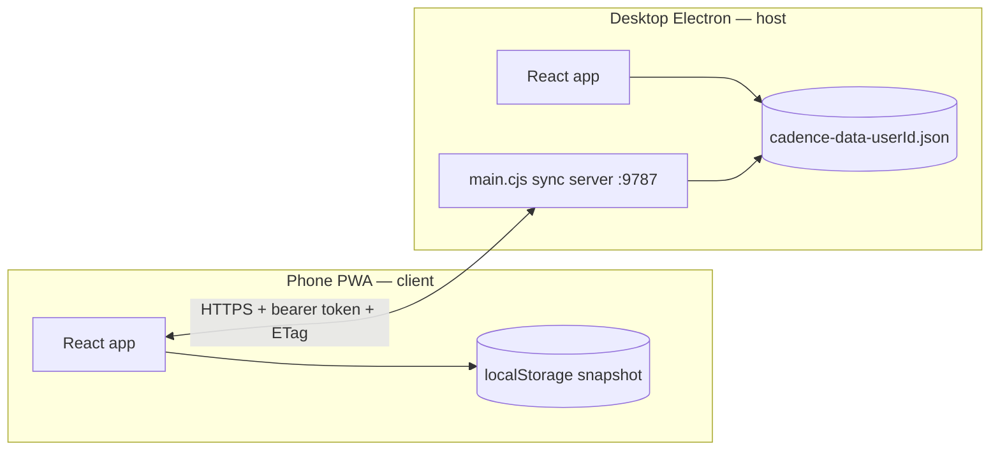

# LAN sync — companion device guide

**Audience:** One person, two devices (desktop + phone/PWA) on the same Wi‑Fi  
**Status:** Supported production use case for Cadence `0.2.x`  
**Related:** [README § LAN sync](../README.md#lan-sync-multi-device-no-cloud), [electron-guide §10](./electron-guide.md#10-lan-sync-http-server), [HEALTH-CHECK-AND-ROADMAP](./HEALTH-CHECK-AND-ROADMAP.md)

---

## What LAN sync is for

LAN sync lets **the same Cadence account** share one workspace between:

| Role | Typical device | Job |
|------|----------------|-----|
| **Host** | Electron desktop (Mac/Windows/Linux) | Canonical encrypted data file, sync HTTPS server, full feature set |
| **Client** | Phone browser / installed PWA | Read and light edit on the go; pushes/pulls snapshot over Wi‑Fi |

This is **not** multi-user collaboration. There is no merge of two people editing the same note at the same time. The design assumes **one human**, **one workspace**, **two screens** — with the desktop as home base.

If you follow the workflow below, **conflicts are rare** and usually mean “you edited on both devices before they synced,” not a broken sync engine.

---

## Architecture (30-second version)

- **Host disk** is the authoritative copy when the desktop is your daily driver.
- **Client** keeps its own copy in browser `localStorage` (unencrypted on the phone).
- **Sync** moves whole workspace snapshots (`AppData` JSON), not individual keystrokes.
- **ETag** (content hash) prevents blind overwrites when the host changed since your last pull.

---

## One-time setup

### On the desktop (host)

1. Sign in to Cadence with your account.
2. Open **Settings → Multi-device sync**.
3. Turn **Enable LAN sync server** on.
4. Note the **LAN URL** (e.g. `https://192.168.1.5:9787/`) and **pairing token** (or scan the **QR code** from the host card).

Requirements:

- Desktop and phone on the **same Wi‑Fi** (guest networks often block device-to-device traffic).
- A user must be **signed in on the host** — `GET /v1/snapshot` returns `503` otherwise.

### On the phone (client)

**Recommended:** scan the host QR code.

1. Open the phone camera → tap the URL banner.
2. On first visit, accept the **“connection is not private”** warning once (self-signed cert). See [README — Why self-signed HTTPS](../README.md#why-self-signed-https-not-plain-http-not-a-real-ca-cert).
3. The PWA loads from the host; `?pair=` in the URL stores host URL + token automatically.

**Alternative:** open the host URL manually, go to **Settings → Pair with another device**, paste URL + token, tap **Pull from host**.

---

## Recommended daily workflow (single user)

This is the **supported** pattern. It avoids 412 conflicts and data surprises.

### Desktop is primary

1. Do most editing on **desktop** (notes, todos, teams).
2. Before leaving your desk, wait for autosave (**Saved** in the note editor, or ~1 s idle).
3. Optional: **Settings → Push to host** is only needed on a *second* desktop client; the host already *is* the source.

### Phone is companion

1. Open the PWA on the same Wi‑Fi → auto-sync runs within ~30 s (or on focus).
2. **Read** agenda/todos/notes on the phone.
3. **Small edits** (check off todo, tweak a note) are fine.
4. When back at the desk, open desktop — auto-sync on the phone should have pushed already; if unsure, open phone Settings and confirm **“synced N min ago”**.

### Golden rules

| Do | Don't |
|----|--------|
| Edit mainly on one device at a time | Edit the **same note** on phone and desktop **at the same time** |
| Finish typing, wait for save, then switch devices | Force-quit desktop mid-sentence |
| Use **Pull from host** after a long phone session before big desktop edits | Assume phone and desktop are live-collab like Google Docs |
| Rotate token if someone else could have scanned your QR | Run LAN sync on untrusted public Wi‑Fi |

---

## What auto-sync does

Background sync (client only, when paired):

| Trigger | Min gap |
|---------|---------|
| ~500 ms after app open | — |
| Window/tab focus | 30 s |
| `visibilitychange` → visible | 30 s |
| Browser `online` event | 30 s |

Algorithm (**push first, pull second**):

1. Compare local content fingerprint with last successful sync fingerprint.
2. If local changed → **push** with `If-Match: lastEtag`.
3. If local unchanged → **pull** with `If-None-Match: lastEtag` (cheap 304 when host unchanged).
4. On push **412 Conflict** → **stop silently** (no overwrite). Resolve manually in Settings.

Manual **Pull** / **Push** in Settings always shows explicit success/error messages.

---

## Conflict handling (412)

A **412 Precondition Failed** means: *the host snapshot changed since you last pulled/pushed*.

Typical single-user causes:

- You edited on desktop while the phone still had an old ETag.
- You edited on phone, then edited on desktop before the phone pushed.
- Another client pushed (rare unless you paired two phones).

**Resolution (Settings on the client):**

1. **Push** → if 412, dialog offers **Pull host's version**.
2. Accept pull → local client gets desktop state.
3. Re-apply any phone-only edits manually, then **Push** again.

Auto-sync **never** auto-picks a winner on 412 — that is intentional.

---

## Data & security notes

| Topic | Host (desktop) | Client (phone PWA) |
|-------|----------------|---------------------|
| Storage | Encrypted file + 50 rolling backups | Browser `localStorage` (not app-encrypted) |
| On wire | TLS (self-signed) + bearer token | Same |
| Attachments | Sidecar files on disk | Synced via LAN attachment manifest when snapshot syncs |

Phone data is **logically separate** until paired. Treat the phone as a cache of your workspace, not a second backup strategy — keep desktop backups (**Export JSON** / full backup folder).

Security details: [README — Sync security](../README.md#sync-security--what-we-did-and-didnt-do).

---

## Known limitations (honest)

These matter for **multi-writer** scenarios; for **one user, sequential use** they are usually acceptable.

| Limitation | Impact for companion use |
|------------|---------------------------|
| Whole-snapshot sync (no CRDT) | Last successful push/pull wins per side |
| No field-level merge | Conflicts are all-or-nothing |
| Host UI not auto-refreshed on phone push | Desktop may show stale UI until reload; **disk is updated**. Avoid editing on desktop immediately after a phone push without pulling or restarting |
| Client `localStorage` | Clearing site data wipes phone copy (desktop unchanged) |
| LAN only | No sync away from home Wi‑Fi — use [Cloud sync (Drive)](../README.md#cloud-sync-google-drive-end-to-end-encrypted) or Export JSON |

Planned improvements (low urgency for single-user): host reload after remote push, visible toast on auto-sync 412. See [HEALTH-CHECK — Phase G](./HEALTH-CHECK-AND-ROADMAP.md#phase-g--lan-sync-polish-optional).

---

## Troubleshooting

| Symptom | Likely cause | Fix |
|---------|--------------|-----|
| Pull failed: 503 | No user signed in on host | Open Cadence on desktop and sign in |
| Pull failed: 401 | Wrong or rotated token | Copy new token from host Settings or re-scan QR |
| Pull failed: timeout | Different network / firewall | Same Wi‑Fi; disable guest isolation |
| Mixed content blocked | PWA opened from `github.io` HTTPS | Open PWA **from host URL** (`https://192.168.x.x:9787/`) |
| Phone shows old data | Auto-sync throttled or offline | Focus app; wait 30 s; or manual Pull |
| Push 412 | Host changed since last sync | Pull host version first (dialog guides you) |
| Cert warning every time | New LAN IP not in cert SAN | Restart host sync or re-enable server to reissue cert |

**Test reachability:** Settings → **Test reachability** hits `GET /v1/ping` (unauthenticated).

---

## Operator checklist

Before relying on LAN sync for travel:

- [ ] Host sync server enabled; QR pairing works once
- [ ] Phone shows **Paired with host** + recent sync time
- [ ] Manual Pull after first pair shows expected notes/todos
- [ ] Desktop **Export JSON** or full backup taken (belt and suspenders)
- [ ] Token rotated if QR was shown in a shared space

---

## Revision history

| Date | Changes |
|------|---------|
| 2026-06-04 | Initial companion-device guide (single-user workflow, limitations, troubleshooting) |
